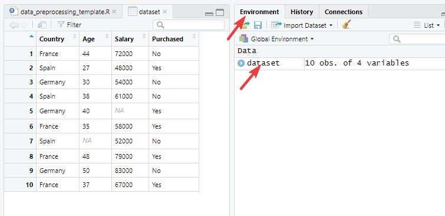
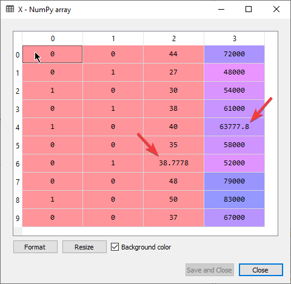

# Data preprocessing

Prima di cominciare, tutti i file usati sono disponibili [qua](https://www.superdatascience.com/pages/machine-learning).

## Nota bene

Per vedere la documentazione sul codice scritto:

- in spyder: `Ctrl+i`

## 1. Ottieni il dataset

Nel dataset ci sono due tipi di variabili, v. dipendenti e indipendenti.

| Country | Age | Salary | Purchased |
| ------- | --- | ------ | --------- |
| France  | 44  | 72000  | No        |
| Spain   | 27  | 48000  | Yes       |
| Germany | 30  | 54000  | No        |
| Spain   | 38  | 61000  | No        |
| Germany | 40  | ,      | es        |
| France  | 35  | 58000  | Yes       |
| Spain   |     | 2000   | No        |
| France  | 48  | 79000  | Yes       |
| Germany | 50  | 83000  | No        |
| France  | 37  | 67000  | Yes       |

Nel file, le variabili **indipendenti** sono:

- country
- age
- salary

In ogni modello di ML vengono usate variabili indipendenti per predire variabili dipendenti.

In pratica: `F(country, age, salary) -> Purchased`.

## 2. Importa le librerie

### In spyder

```python
# numpy contiene le funzioni matematiche
import numpy as np
# matplotlib.pyplot permette di fare i grafici
import matplotlib.pyplot as plt
# pandas serve a importare e maneggiare dataset
import pandas as pd
```

Seleziona le 3 righe degli import e premi Ctrl+Invio per eseguirle.

### In RStudio

Le librerie sono scaricabili dalla finestra dedicata ai package, dove si possono selezionare e deselezionare.

## 3. Import dei dataset

### In spyder

La **working directory** è in automatico la cartella in cui è salvato il file sorgente dello script in python.

Per importare il dataset si usa la libreria `pandas`:

```python
# legge il csv specificato e lo salva nel dataset
dataset = pd.read_csv('Data.csv')
```

Il file importato, salvato nella variabile `dataset`, diventa visibile nel **variable explorer** sulla destra. Da là lo si può visionare e modificarne il formato dei campi.


Ora bisogna creare:

- la **Matrice di Features** usando le **variabili indipendenti** *Country, Age, Salary*.
- il vettore di variabili dipendenti usando la colonna *Purchased*.

```python
# matrice di features
X = dataset.iloc[:, :-1].values # seleziona tutte le righe delle 3 colonne desiderate (tutte tranne l'ultima)
y = dataset.iloc[:, 3].values # selezione tutte le righe dell'ultima colonna (indice 3)
```

> Il comando `iloc[:,:-1]` vuol dire:
> 
> - a sinistra della virgola si specificano le righe
>   - prendi tutte le righe, dalla prima all'ultima
> - a destra della virgola si specificano le colonne
>   - parti dalla prima colonne e fermati prima dell'ultima

Digitando `X` nella console di spyder viene stampato:

```cmd
Out[6]:
array([['France', 44.0, 72000.0],
    ['Spain', 27.0, 48000.0],
    ['Germany', 30.0, 54000.0],
    ['Spain', 38.0, 61000.0],
    ['Germany', 40.0, nan],
    ['France', 35.0, 58000.0],
    ['Spain', nan, 52000.0],
    ['France', 48.0, 79000.0],
    ['Germany', 50.0, 83000.0],
    ['France', 37.0, 67000.0]], dtype=object)
```

Digitando `y` nella console di spyder viene stampato:

```cmd
Out[10]: 
array(['No', 'Yes', 'No', 'No', 'Yes', 'Yes', 'No', 'Yes', 'No', 'Yes'],
    dtype=object)
```

### In RStudio

Setta la cartella del file da elaborare come working directory usando il file explorer:


Importa il dataset (non è necessario creare la matrice di variabili indipendenti e l'array di var dipendenti.)

```R
dataset = read.csv('Data.csv')
```

Digitando `dataset` nel terminale di RStudio viene stampato:

```
> dataset
   Country Age Salary Purchased
1   France  44  72000        No
2    Spain  27  48000       Yes
3  Germany  30  54000        No
4    Spain  38  61000        No
5  Germany  40     NA       Yes
6   France  35  58000       Yes
7    Spain  NA  52000        No
8   France  48  79000       Yes
9  Germany  50  83000        No
10  France  37  67000       Yes
```

La variabile dataset è visibile anche nella tab environment:



**NB: l'indice in R comincia da 1**

## 3 Missing data

Bisogna gestire anche le situazioni in cui ci sono dataset incompleti.

Le celle vuote vengono riempite con il **mean value** (media aritmetica) dei dati contenuti nella colonna.

### In python

```python
from sklearn.impute import SimpleImputer
simple_imputer = SimpleImputer(missing_values=np.nan, strategy="mean")
simple_imputer.fit(X[:, 1:3])
X[:, 1:3] = simple_imputer.transform(X[:, 1:3])
```

`sklearn` è una libreria che permette di creare dei modelli.
La classe `SimpleImputer` di `sklearn.impute` permette di attribuire dei valori ai campi vuoti.

Eseguendo

```python
simple_imputer = SimpleImputer(missing_values=np.nan, strategy="mean")
```

Il parametro `strategy="mean"` indica di ricercare il parametro mean **rispetto alla colonna**.

il `dataset` viene arricchito con campi `nan`.



Eseguendo

```python
simple_imputer.fit(X[:, 1:3])
```

si esegue l'inserimento dei mean value solo nelle colonne in cui ci sono dati mancanti, cioè 2a e 3a, ma guardando tutte le righe: in pratica il mean value è guardato sull'intera colonna e applicato alle sole celle vuote.

Eseguendo

```python
X[:, 1:3] = simple_imputer.transform(X[:, 1:3])
```

si sovrascrivono le colonne di X con i nuovi dati.

```cmd
array([['France', 44.0, 72000.0],
    ['Spain', 27.0, 48000.0],
    ['Germany', 30.0, 54000.0],
    ['Spain', 38.0, 61000.0],
    ['Germany', 40.0, 63777.77777777778],
    ['France', 35.0, 58000.0],
    ['Spain', 38.77777777777778, 52000.0],
    ['France', 48.0, 79000.0],
    ['Germany', 50.0, 83000.0],
    ['France', 37.0, 67000.0]], dtype=object)
```

### In R

Per rimpiazzare i valori vuoti con la media della singola colonna:

```R
dataset$Age[is.na(dataset$Age)] <- mean(dataset$Age, na.rm=TRUE)
dataset$Salary[is.na(dataset$Salary)] <- mean(dataset$Salary, na.rm=TRUE)
```

Il dataset diventa


