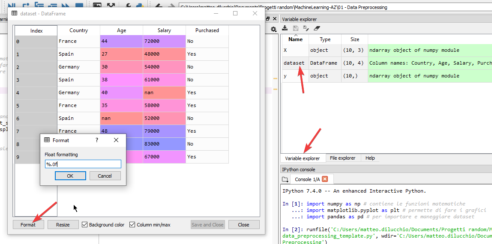

# Data preprocessing

Prima di cominciare, tutti i file usati sono disponibili [qua](https://www.superdatascience.com/pages/machine-learning).

## Nota bene

Per vedere la documentazione sul codice scritto:

- in spyder: `Ctrl+i`

## 1. Ottieni il dataset

Nel dataset ci sono due tipi di variabili, v. dipendenti e indipendenti.

| Country | Age | Salary | Purchased |
| ------- | --- | ------ | --------- |
| France  | 44  | 72000  | No        |
| Spain   | 27  | 48000  | Yes       |
| Germany | 30  | 54000  | No        |
| Spain   | 38  | 61000  | No        |
| Germany | 40  | ,      | es        |
| France  | 35  | 58000  | Yes       |
| Spain   |     | 2000   | No        |
| France  | 48  | 79000  | Yes       |
| Germany | 50  | 83000  | No        |
| France  | 37  | 67000  | Yes       |

Nel file, le variabili **indipendenti** sono:

- country
- age
- salary

In ogni modello di ML vengono usate variabili indipendenti per predire variabili dipendenti.

In pratica: `F(country, age, salary) -> Purchased`.

## 2. Importa le librerie

### In spyder

```python
# numpy contiene le funzioni matematiche
import numpy as np
# matplotlib.pyplot permette di fare i grafici
import matplotlib.pyplot as plt
# pandas serve a importare e maneggiare dataset
import pandas as pd
```

Seleziona le 3 righe degli import e premi Ctrl+Invio per eseguirle.

### In RStudio

Le librerie sono scaricabili dalla finestra dedicata ai package, dove si possono selezionare e deselezionare.

## 3. Import dei dataset

### In spyder

La **working directory** è in automatico la cartella in cui è salvato il file sorgente dello script in python.

Per importare il dataset si usa la libreria `pandas`:

```python
# legge il csv specificato e lo salva nel dataset
dataset = pd.read_csv('Data.csv')
```

Il file importato, salvato nella variabile `dataset`, diventa visibile nel **variable explorer** sulla destra. Da là lo si può visionare e modificarne il formato dei campi.



## 4. Encode categorical data

Categorical data sono variabili che contengono categorie, tipo *Country* e *Purchased*.

- *Country*: contiene le categorie *France*, *Spain*, *Germany*.
- *Purchased*: contiene le categorie *Yes* e *No*.

Per risolvere i calcoli matematici è necessario che le categorie (testuali) vengano espresse tramite numeri: bisogna **codificare le categorie**.

```Python
country_dummies = pd.get_dummies(dataset.Country, prefix="Country", drop_first=True)
dataset = pd.concat([country_dummies, dataset], axis = 1)
dataset = pd.DataFrame.drop(dataset, columns=["Country"])
```

`get_dummies` permette di **codificare delle classi** assegnando dei numeri da `0` a `n_classi-1`.

Con il codice

```Python
country_dummies = pd.get_dummies(dataset.Country, prefix="Country", drop_first=True)
```

Viene creata la tabella fatta così:


- `prefix="Country"` aggiungono il prefisso `Country_` al nome della colonna.
- `drop_first=True` elimina una colonna. Per codificare con dummy data N variabili vengono generate N colonne, ma ne bastano N-1.

Con il codice

```Python
dataset = pd.concat([country_dummies, dataset], axis = 1)
dataset = pd.DataFrame.drop(dataset, columns=["Country"])
```

le nuove colonne di dummy data rimpiazzano quella codificata (`Country`).


Ripetendo la procedura precedente anche per la colonna `Purchased` si ottiene la seguente tabella:


## 5. Variabili dipendenti e indipendenti

Ora bisogna creare:

- la **Matrice di Features** usando le **variabili indipendenti** *Country, Age, Salary*.
- il vettore di variabili dipendenti usando la colonna *Purchased*.

```Python
X = dataset.iloc[:, :-1].to_numpy()
y = dataset.iloc[:, -1].to_numpy()
```

> Il comando `iloc[:,:-1]` vuol dire:
> 
> - a sinistra della virgola si specificano le righe
>   - prendi tutte le righe, dalla prima all'ultima
> - a destra della virgola si specificano le colonne
>   - parti dalla prima colonne e fermati prima dell'ultima

Digitando `X` nella console di spyder viene stampato:

```cmd
array([[0.0e+00, 0.0e+00, 4.4e+01, 7.2e+04],
       [0.0e+00, 1.0e+00, 2.7e+01, 4.8e+04],
       [1.0e+00, 0.0e+00, 3.0e+01, 5.4e+04],
       [0.0e+00, 1.0e+00, 3.8e+01, 6.1e+04],
       [1.0e+00, 0.0e+00, 4.0e+01,     nan],
       [0.0e+00, 0.0e+00, 3.5e+01, 5.8e+04],
       [0.0e+00, 1.0e+00,     nan, 5.2e+04],
       [0.0e+00, 0.0e+00, 4.8e+01, 7.9e+04],
       [1.0e+00, 0.0e+00, 5.0e+01, 8.3e+04],
       [0.0e+00, 0.0e+00, 3.7e+01, 6.7e+04]])
```

Digitando `y` nella console di spyder viene stampato:

```cmd
array(['No', 'Yes', 'No', 'No', 'Yes', 'Yes', 'No', 'Yes', 'No', 'Yes'],
    dtype=object)
```

## 6. Missing data

Bisogna gestire anche le situazioni in cui ci sono dataset incompleti.

Le celle vuote vengono riempite con il **mean value** (**media aritmetica**) dei dati contenuti nella colonna.

### In python

```python
from sklearn.impute import SimpleImputer
simple_imputer = SimpleImputer(missing_values=np.nan, strategy="mean")
simple_imputer.fit(X[:, 2:4]) # simple_imputer viene fatto lavorare solo nelle colonne dove ci sono dati mancanti
X[:, 2:4] = simple_imputer.transform(X[:, 2:4])
```

`sklearn` è una libreria che permette di creare dei modelli.
La classe `SimpleImputer` di `sklearn.impute` permette di attribuire dei valori ai campi vuoti.

Eseguendo

```python
simple_imputer = SimpleImputer(missing_values=np.nan, strategy="mean")
```

Il parametro `strategy="mean"` indica di ricercare il parametro mean **rispetto alla colonna**.

il `dataset` viene arricchito con campi `nan`.


Eseguendo

```python
simple_imputer.fit(X[:, 1:3])
```

si esegue l'inserimento dei mean value solo nelle colonne in cui ci sono dati mancanti, cioè 3a e 4a, ma guardando tutte le righe: in pratica il mean value è guardato sull'intera colonna e applicato alle sole celle vuote.

Eseguendo

```python
X[:, 2:4] = simple_imputer.transform(X[:, 2:4])
```

si sovrascrivono le colonne di X con i nuovi dati.

```cmd
array([[0.00000000e+00, 0.00000000e+00, 4.40000000e+01, 7.20000000e+04],
       [0.00000000e+00, 1.00000000e+00, 2.70000000e+01, 4.80000000e+04],
       [1.00000000e+00, 0.00000000e+00, 3.00000000e+01, 5.40000000e+04],
       [0.00000000e+00, 1.00000000e+00, 3.80000000e+01, 6.10000000e+04],
       [1.00000000e+00, 0.00000000e+00, 4.00000000e+01, 6.37777778e+04],
       [0.00000000e+00, 0.00000000e+00, 3.50000000e+01, 5.80000000e+04],
       [0.00000000e+00, 1.00000000e+00, 3.87777778e+01, 5.20000000e+04],
       [0.00000000e+00, 0.00000000e+00, 4.80000000e+01, 7.90000000e+04],
       [1.00000000e+00, 0.00000000e+00, 5.00000000e+01, 8.30000000e+04],
       [0.00000000e+00, 0.00000000e+00, 3.70000000e+01, 6.70000000e+04]])
```

7. Split in training set e test set

Per splittare il dataset in:

- training set
- test set

si usa il seguente codice

```python
from sklearn.model_selection import train_test_split
X_train, X_test, y_train, y_test = train_test_split(X, y, test_size = 0.2, random_state = 0)
```

e creando le variabili:

- X_test, y_test
- X_train, y_train


La funzione `train_test_split` ha preso come parametri:

- `X, y`: i dati da splittare
- `test_size = 0.2`: per indicare che il training set usa l'80% dei dati e il test set solo il 20%
- `random_state = 0`: per passare un valore intero che inizializza il generatore di numeri casuali (anche 42 andrebbe bene, non cambia niente)

```Python
train_test_split(X, y, test_size = 0.2, random_state = 0)
```