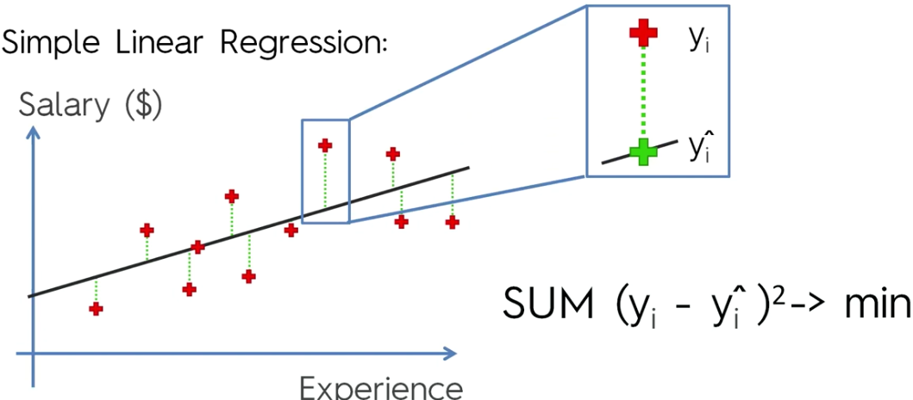

# Regressori

## R Squared

Lo scopo era trovare il minimo tra tutti i possibili risultati dell'equazione $\sum(y_i - \hat{y_i})^2$

- $SS_{RES} = \sum(y_i - \hat{y_i})^2$
- $SS_{TOT} = \sum(y_i - \hat{y}_{avg})^2$

$$R^2 = 1 - \frac{SS_{RES}}{SS_{TOT}}$$

Più $R^2$ tende a $1$ e maggiore è la bontà della stima.

## Adjusted R Squared $Adj R^2$

$$Adj R^2 = 1-(1-R^2)\frac{n-1}{n-p-1}$$

- $p$ è il numero di regressori
- $n$ dimensione dell'esempio

Aumentando il numero di variabili $R^2$ aumenta sempre, anche con variabili completamente a caso.
