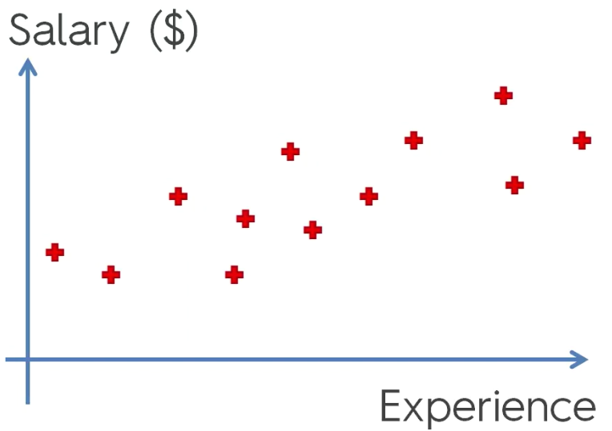
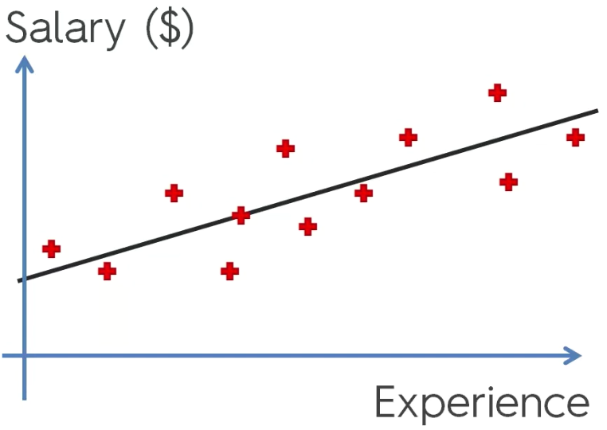
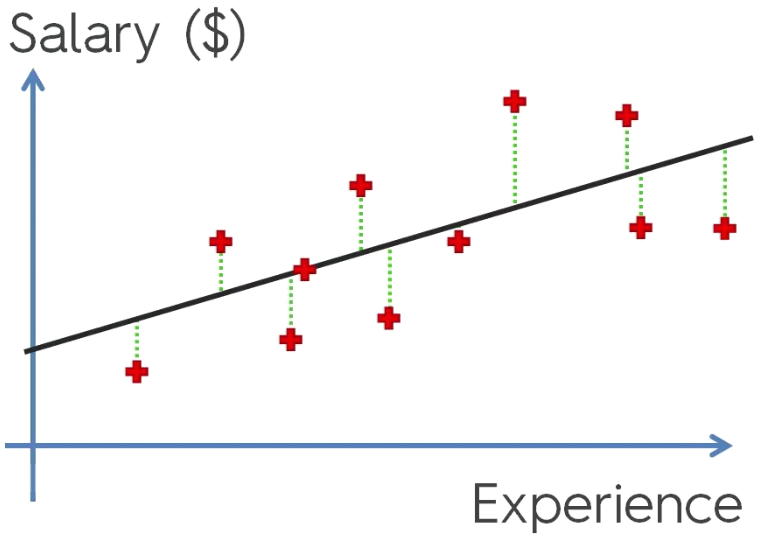
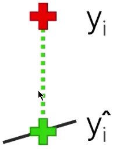
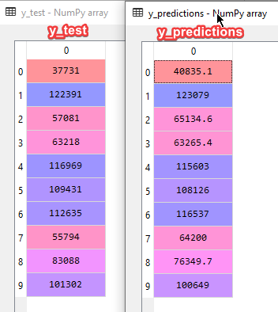

# Regressione Lineare Semplice

$$ y = b_0 + b_1 * x_1$$

- $y$ è la variabile dipendente
- $x_1$ è la variabile indipendente
- $b_1$ è il coefficiente della var indipendente
- $b_0$ è la costante

La variabile dipendente è influenzata dalla variabile indipendente.

Per esempio, si vuole valutare l'andamento degli stipendi al variare dell'esperienza.

Inizialmente il grafico è popolato da coppie stipendio-esperienza.



Si applica la formula:
$$ Salary = b_0 + b_1 * Experience $$

e si ottiene



cioè una retta che meglio rappresenta il *trand* dei dati.

- $b_0$ indica dove il grafico tocca l'asse y
- $b_1$ rappresenta l'inclinazione della retta

## Come trovare la retta del trand



Le distanze dei punti rispetto alla retta mostrano quello che effettivamente prende una persona $y_i$ con tot anni di esperienza, rispetto a quello che dovrebbe prendere stando al modello $\hat{y_i}$.



Per calcolare $b_0$ e $b_1$ si usa il **metodo dei minimi quadrati** per minimizzare la distanza tra i valori puntuali e i valori teorici sulla retta di regressione.

Si vuole minimizzare la funzione $\sum(y-\hat{y})^2$ che è graficamente rappresentata dalla miglior retta di regressione possibile.

## Regressione lineare semplice in python

### 1. Importa le librerie

```Python
import numpy as np
import matplotlib.pyplot as plt
import pandas as pd
```

### 2. Importa il dataset

```Python
dataset = pd.read_csv('Salary_Data.csv')
X = dataset.iloc[:, :-1].values
y = dataset.iloc[:, 1].values
```

### 3. Splitta il dataset in training set e test set

```Python
from sklearn.model_selection import train_test_split
X_train, X_test, y_train, y_test = train_test_split(X, y, test_size = 1/3, random_state = 0)
```

### 4. NO feature scaling

La libreria della regressione lineare lo fa automaticamente.

### 5. Fitting della regressione lineare semplice sul training set

```Python
from sklearn.linear_model import LinearRegression
regressor = LinearRegression()
regressor.fit(X_train, y_train)
```

Viene usata la classe `LinearRegression` della libreria `sklearn.linear_model`.

Il fitting viene effettuato dal metodo `regressor.fit(X_train, y_train)`.

Parametri richiesti:

- matrice di features: training data
- array di variabili dipendenti: target values

Questo codice crea un modello di regressione lineare semplice in grado di calcolarsi la sua funzione $y=a+bx$ per poter stimare ogni salario sulla base degli anni di esperienza.

### 6. Stima dei risultati sul test set

Per fare le previsioni sul test set si usa:

```Python
y_predictions = regressor.predict(X_test)
```

L'unico parametro richiesto è il set su cui il modello deve fare delle previsioni.

Si ottiene l'array di previsioni `y_predictions`.
`y_test` e `y_predictions` possono essere confrontati per capire i valori reali rispetto alla stima del modello.


