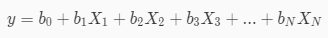
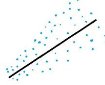
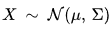
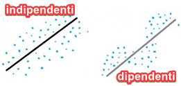
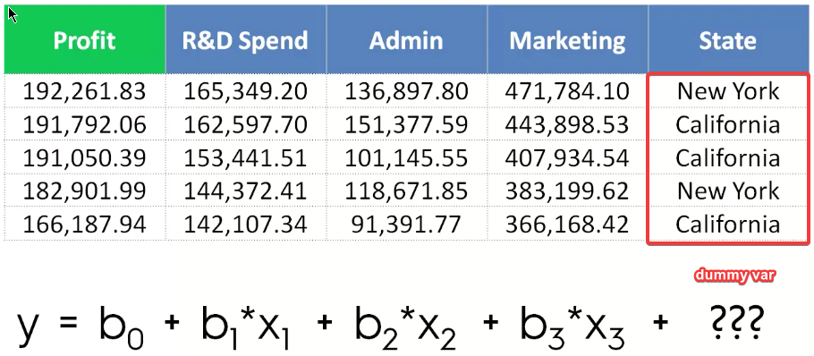
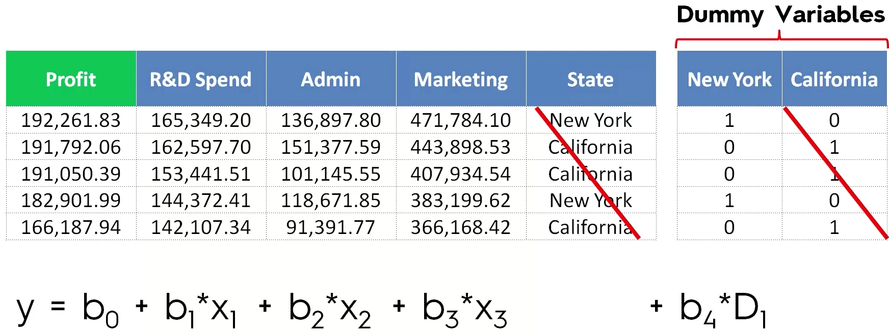

- [Multiple linear regression](#Multiple-linear-regression)
  - [Problema](#Problema)
  - [Dummy variables](#Dummy-variables)
  - [Come costruire un modello](#Come-costruire-un-modello)
    - [1. All in](#1-All-in)
    - [2. Backward elimination](#2-Backward-elimination)
    - [3. Forward selection](#3-Forward-selection)
    - [4. Bidirectional elimination](#4-Bidirectional-elimination)
    - [5. All possible models](#5-All-possible-models)
  - [---](#)
  - [Backward elimination in Python](#Backward-elimination-in-Python)
    - [Codice](#Codice)
    - [Spiegazione](#Spiegazione)

# Multiple linear regression



- ***y*** è la **variabile dipendente**
- le ***Xi*** soono le **variabili indipendenti**
- le ***b*** sono i **coefficienti**

Un problema di Regressione Lineare deve soddisfare dei requisiti:

1. Linearità
2. omoschedasticità: tutte le variabili hanno uguale varianza<br>
3. le variabili segueono la distribuzione Normale Multivariata: cioè ogni loro combinazione lineare segue la distribuzione Normale.<br>
4. errori indipendenti: se i punti seguono un andamento strano è possibile che ci siano delle influenze<br>
5. mancanza di multicollinearità: La multicollinearità sorge quando c’è un’elevata correlazione tra due o più variabili esplicative.

## Problema

Dato un csv con informazioni su 50 startup, si vuole capire quale chi e perchè performa meglio degli altri: dove sono, come spendono e in cosa investono.

## Dummy variables



CI sono due possibili caategorie nel colonna State, quindi si usa una Dummy Variable e si continua l'equazione:



Non puoi mai aggiungere tutte le DUmmy Variables: per rappresentare N variabili bastano N-1 colonne.

## Come costruire un modello

### 1. All in

Usa tutte le variabili, perchè **sai già che tutte sono importanti per la stima finale** oppure perchè stai preparando il campo per **applicare backward elimination**.

### 2. Backward elimination

1. seleziona un livello di significatività per restare nel modello ($SL = 0,05$)
2. aggiungi al modello tutti le variabili dipendenti X
3. si considera la variabile $X_i$ che ha il P-value più alto
   - se $P-value > SL$ vai allo step **4.**
   - **altrimenti hai finito e il modello è pronto**
4. rimuovi quella variabile
5. fai il fit del modello senza usare questa variabile (*in pratica rifai il modello senza quella variabile*)
6. ritorna al punto **3.**

### 3. Forward selection

1. seleziona un livello di significatività ($SL = 0.05$)
2. fai il fit di ogni possibile regressione lineare semplice $y \sim X_n$ e seleziona quella con $SL$  minore
3. tieni questa variabile e fai il fit di ogni possibile modello usando questa variabile e una variabile alla volta tra le altre di cui disponi.<br>In pratica si tenta ogni altro possibile modello calcolato da una coppia di variabili.<br>**Esempio**: ho le variabili A, B, C, D, E e scelgo A. Costruisco ogni modello di regressione lineare semplice usando le coppie AB, AC, AD, AE.
4. Tra tutte le coppie, considera quella dove la variabile aggiunta ha il P-value minore.
   - Se il P-value è minore di SL allora si torna al punto 3
   - altrimenti **hai finito, ma tieni il modello precedente**, cioè senza l'ultima variabile aggiunta.

### 4. Bidirectional elimination

1. seleziona un livello di significatività per entrare nel modello $SL_{ENTER}=0.05$ e uno per restare nel modello $SL_{STAY} = 0.05$
2. esegui il passo successivo di **Forward selection**
   - la variabile entrante deve avere $P_{VALUE}<SL_{ENTER}$
3. esegui tutti i passi di **backward elimination**
   - le vecchie variabili vengono rimosse se hanno $P_{VALUE}>SL_{STAY}$
4. se ci sono variabili che possono entrare o uscire:
   - torna al punto **2.**
   - altrimenti hai finito, il modello è pronto

### 5. All possible models

1. seleziona un criterio di bontà del fit (es: criterio Akaike)
2. costruisci tutti i possibili modelli di regressione: $2^{N-1}$ combinazioni totali
3. seleziona quella che riflette meglio il criterio scelto al punto 1.
4. hai finito.

---
---

## Backward elimination in Python

Dopo aver:

- importato il dataset
- sistemato le dummy variables
- splittato il dataset in X e y
- splittato in training set e test set
- creato un modello di regressione lineare
- aggiunto l'array di $b_0$

si può procedere con backward elimination.

### Codice

```Python
import statsmodels.formula.api as sm
X = np.append(arr = np.ones((50, 1)).astype(int), values = X, axis = 1)
X_opt = X[:, [0,1,2,3,4,5]]
regresson_OLS = sm.OLS(endog = y, exog = X_opt).fit()
regressor_OLS.summary()

# backward elimination

# rimuovo X2
X_opt = X[:, [0,1,3,4,5]]
regressor_OLS = sm.OLS(endog = y, exog = X_opt).fit()
regressor_OLS.summary()

# rimuovo X1
X_opt = X[:, [0,3,4,5]]
regressor_OLS = sm.OLS(endog = y, exog = X_opt).fit()
regressor_OLS.summary()

# rimuovo X4
X_opt = X[:, [0,3,5]]
regressor_OLS = sm.OLS(endog = y, exog = X_opt).fit()
regressor_OLS.summary()

# rimuovo X5
X_opt = X[:, [0,3]]
regressor_OLS = sm.OLS(endog = y, exog = X_opt).fit()
regressor_OLS.summary()
```

### Spiegazione

Nell'esempio delle 50 startup non c'è una colonna in grado di rappresentare la costante $b_0$ dell'equazione della regressione, quindi dobbiamo gestirlo a mano se la libreria non lo fa in automatico.

Nella libreria:

```Python
import statsmodels.formula.api as sm
```

non viene gestito in automatico e dobbiamo pensarci noi.

Aggiungiamo alla matrice X una colonna di soli `1`:

```Python
X = np.append(arr = np.ones((50, 1)).astype(int), values = X, axis = 1)
```

Crea una matrice di features ottimale (inizialmente uguale a `X`) che viene sfoltita poco per volta:

```Python
X_opt = X[:, [0,1,2,3,4,5]]
# oppure X_opt = X[:, :]
# oppure X_opt = X
```

Seleziona un livello di significatività (ad esempio del 5%: 0.05).

Esegui il fit del modello con tutte le X:

```Python
regresson_OLS = sm.OLS(endog = y, exog = X_opt).fit()
```

Considera le *Xi* con i *P-value* maggiori. Se *P>SL* rimuovilo *Xi*, altrimenti hai finito.

Questo codice fornisce in output un sacco di informazioni utili sulle variabili usate:

```Python
regressor_OLS.summary()
```

```cmd
<class 'statsmodels.iolib.summary.Summary'>
"""
                            OLS Regression Results
==============================================================================
Dep. Variable:                      y   R-squared:                       0.951
Model:                            OLS   Adj. R-squared:                  0.945
Method:                 Least Squares   F-statistic:                     169.9
Date:                Fri, 05 Jul 2019   Prob (F-statistic):           1.34e-27
Time:                        12:45:42   Log-Likelihood:                -525.38
No. Observations:                  50   AIC:                             1063.
Df Residuals:                      44   BIC:                             1074.
Df Model:                           5
Covariance Type:            nonrobust
==============================================================================
                 coef    std err          t      P>|t|      [0.025      0.975]
------------------------------------------------------------------------------
const       5.013e+04   6884.820      7.281      0.000    3.62e+04     6.4e+04
x1           198.7888   3371.007      0.059      0.953   -6595.030    6992.607
x2           -41.8870   3256.039     -0.013      0.990   -6604.003    6520.229
x3             0.8060      0.046     17.369      0.000       0.712       0.900
x4            -0.0270      0.052     -0.517      0.608      -0.132       0.078
x5             0.0270      0.017      1.574      0.123      -0.008       0.062
==============================================================================
Omnibus:                       14.782   Durbin-Watson:                   1.283
Prob(Omnibus):                  0.001   Jarque-Bera (JB):               21.266
Skew:                          -0.948   Prob(JB):                     2.41e-05
Kurtosis:                       5.572   Cond. No.                     1.45e+06
==============================================================================

Warnings:
[1] Standard Errors assume that the covariance matrix of the errors is correctly specified.
[2] The condition number is large, 1.45e+06. This might indicate that there are
strong multicollinearity or other numerical problems.
"""
```

Alla colonna `P>|t|` abbiamo i *P-value*.

Guardando la tabella capiamo di rimuovere `X2` (colonna 3) che ha *P-value* di `0.990`.
Per rimuoverla basta duplicare gli step precedenti escludendo la colonna di `X2`:

```Python
# rimuovo X2
X_opt = X[:, [0,1,3,4,5]]
regressor_OLS = sm.OLS(endog = y, exog = X_opt).fit()
regressor_OLS.summary()
```

Continuo a rimuovere una colonna alla volta fino a ottenere

```Python
X_opt = X[:, [0,3]]
```

Ora non ci sono variabili con un P-value > 0.05, quindi il modello è pronto.
