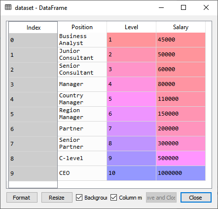
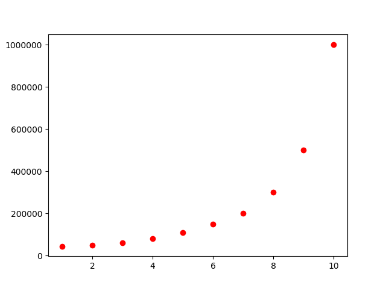
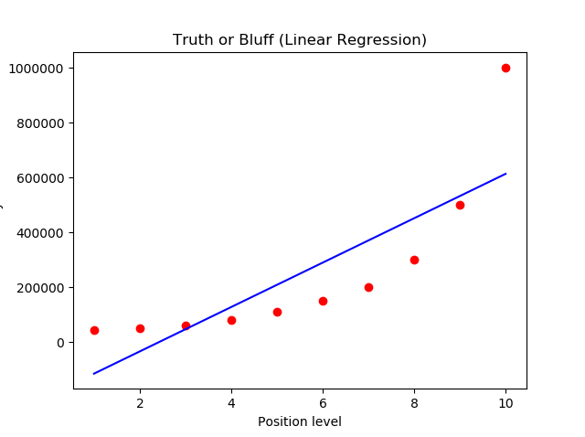
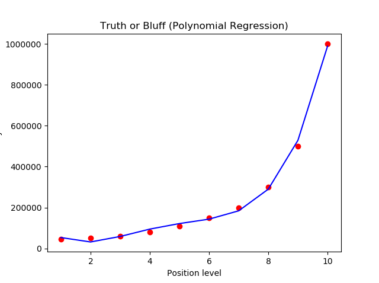
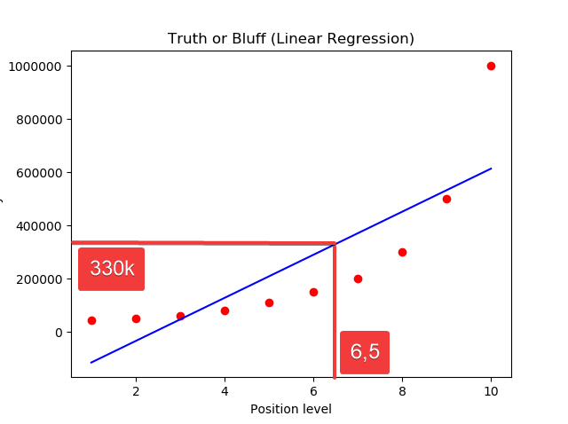
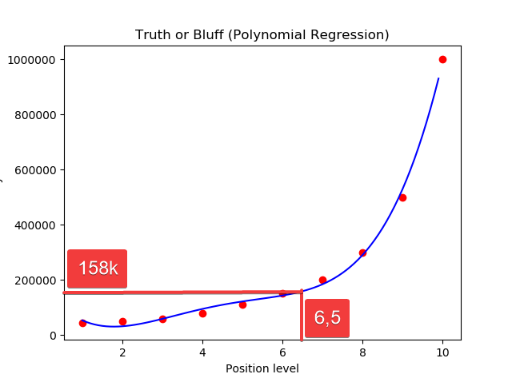

# Regressione lineare polinomiale in Python

Si vuole stabilire il salario di un nuovo potenziale assunto in azienda.

Comincia la contrattazione e lui afferma di aver 20 anni di esperienza e uno stipendio di 160K.

**Si vuole stabilire se effettivamente è possibile che con la sua posizione e i suoi anni di esperienza avesse quello stipendio.**

Il tizio dell'HR contatta la precedente azienda e ottiene questa tabella sugli stipendi:



La colonna `Positions` non serve perchè corrisponde 1:1 con la colonna `level`, quindi è come se fosse già codificata con dummy variables.

Con

```Py
dataset = pd.read_csv('Position_Salaries.csv')
X = dataset.iloc[:, 1:2].values
y = dataset.iloc[:, 2].values
```

si import il dataset, con un accorgimento. Tolta la colonna `Position`, la *y* prende `Salary` e la **matrice *X*** prende `Level`, che è un **array**.

**X deve essere una matrice, sempre**.

Usare `X = dataset.iloc[:, 1:2].values` invece di `X = dataset.iloc[:, 1].values` permette di vedere *X* come matrice con una singola colonna invece che come array.

## Splitting del dataset

In questo caso ogni informazione del dataset ci serve come training, inoltre ci sono troppo poche informazioni per effettuare lo split in training e test set.

## Feature scaling

Non è necessario perchè la libreria usata lo fa in automatico.

## Fitting linear regression nel dataset

Si instanzia un oggetto di regressione lineare usando *X* e *y*.

```Py
from sklearn.linear_model import LinearRegression
lin_reg = LinearRegression()
lin_reg.fit(X, y)
```

# Fitting Polynomial Regression to the dataset

```Py
# trasforma X nella matrice delle potenze di X
from sklearn.preprocessing import PolynomialFeatures 
poly_reg = PolynomialFeatures(degree = 4)
X_poly = poly_reg.fit_transform(X)
#poly_reg.fit(X_poly, y)
# crea un nuovo linear regression object per fare il fit usando X_poly
lin_reg_2 = LinearRegression()
lin_reg_2.fit(X_poly, y)
```

- `poly_reg = PolynomialFeatures(degree = 4)`
- `X_poly = poly_reg.fit_transform(X)`

crea una matrice di features con le varie potenze delle variabili considerate.
| $X_i^0$ | $X_i$  | $X_i^2$ | $X_i^3$ | $X_i^4$ |
| ------- | ------ | ------- | ------- | ------- |
| 1       | **1**  | 1       | 1       | 1       |
| 1       | **2**  | 4       | 8       | 16      |
| 1       | **3**  | 9       | 27      | 81      |
| 1       | **4**  | 16      | 64      | 256     |
| 1       | **5**  | 25      | 125     | 625     |
| 1       | **6**  | 36      | 216     | 1296    |
| 1       | **7**  | 49      | 343     | 2401    |
| 1       | **8**  | 64      | 512     | 4096    |
| 1       | **9**  | 81      | 729     | 6561    |
| 1       | **10** | 100     | 1000    | 10000   |

Viene creato un secondo regressore usando `X_poly`

```Py
lin_reg_2 = LinearRegression() # crea un nuovo linear regression object per fare il fit usando X_poly
lin_reg_2.fit(X_poly, y)
```

## Plot dei risultati VS i dati originali (come **regressione LINEARE**)

```Py
plt.scatter(X, y, color = 'red')
plt.plot(X, lin_reg.predict(X), color = 'blue')
plt.title('Truth or Bluff (Linear Regression)')
plt.xlabel('Position level')
plt.ylabel('Salary')
plt.show()
```

### Dati osservati del dataset



```Py
plt.scatter(X, y, color = 'red')
```

Parametri:

- coordinate X
- coordinate y
- colore

### Dati stimati dal modello



Parametri:

- coordinate X
- plt.plot(X, lin_reg.predict(X), color = 'blue')
- colore

`lin_reg.predict(X)` esegue i calcoli del modello sul set passato *X*.

```Py
plt.plot(X, lin_reg.predict(X), color = 'blue')
```

> Essendo un modello **lineare** ogni stima fatta (linea blu) sarà sempre una retta.

Si vede come le stime fatte sono solo due, quindi il modello è fatto male.

## Plot dei risultati VS i dati originali (come **regressione POLINOMIALE**)

```Py
plt.scatter(X, y, color = 'red')
plt.plot(X, lin_reg_2.predict(poly_reg.fit_transform(X)), color = 'blue')
plt.title('Truth or Bluff (Polynomial Regression)')
plt.xlabel('Position level')
plt.ylabel('Salary')
plt.show()
```



La stima passa per tutti i punti e sembra molto accurata, quindi possiamo anche dire che `PolynomialFeatyres(degree = 4)` è azzeccato.

Per rendere la curva continua si può aumentare la *risoluzione* delle linee tracciate:

```Py
X_grid = np.arange(min(X), max(X), 0.1)
X_grid = X_grid.reshape((len(X_grid), 1))
plt.scatter(X, y, color = 'red')
plt.plot(X_grid, lin_reg_2.predict(poly_reg.fit_transform(X_grid)), color = 'blue')
plt.title('Truth or Bluff (Polynomial Regression)')
plt.xlabel('Position level')
plt.ylabel('Salary')
plt.show()
```


## Stima dello stipendio

### Col modello (errato) lineare

```py
lin_reg.predict([[6.5]])
```

```cmd
Out[26]:
    array([330378.78787879])
```



### Col modello (corretto) polinomiale

```Py
lin_reg_2.predict(poly_reg.fit_transform([[6.5]]))
```

```Cmd
Out[28]:
    array([158862.45265153])
```

