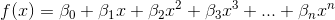
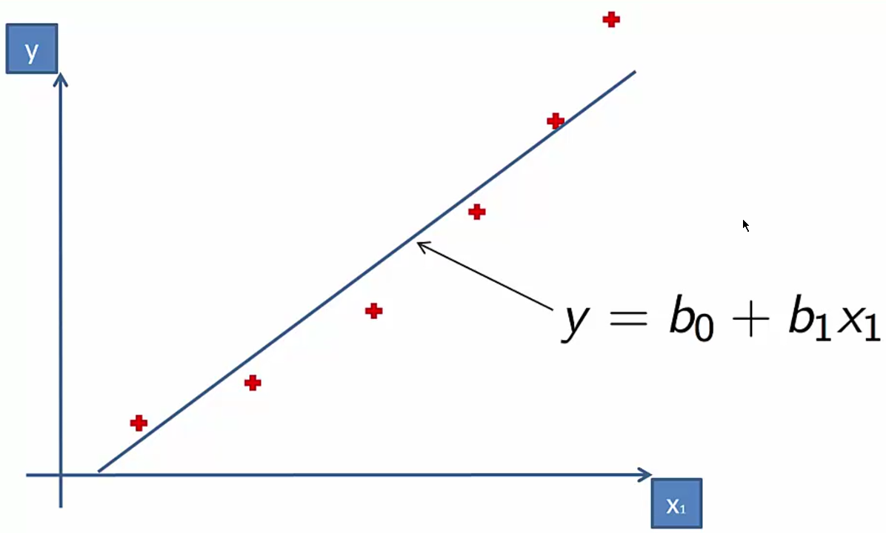
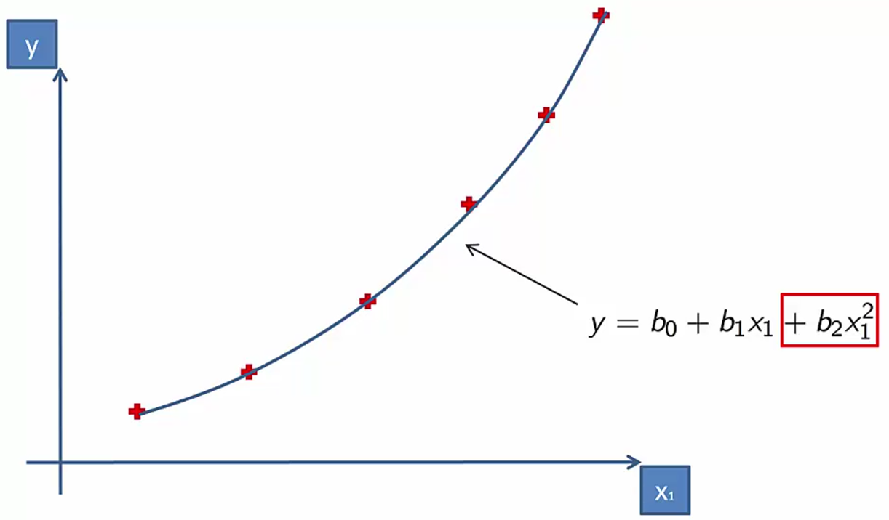

# Polynomial Linear Regression

Viene usata un'unica variabile ma con potenze maggiori di 2.

## Casi d'uso

In questo esempio la **regressione lineare semplice** non va bene:

Mentre con la **regressione lineare polinomiale** siamo in grado di rappresentare la curva:

Il quadrato delle *X* rende la curva parabolica.

> Si chiama LINEARE perchè i coefficienti delle X sono lineari.
