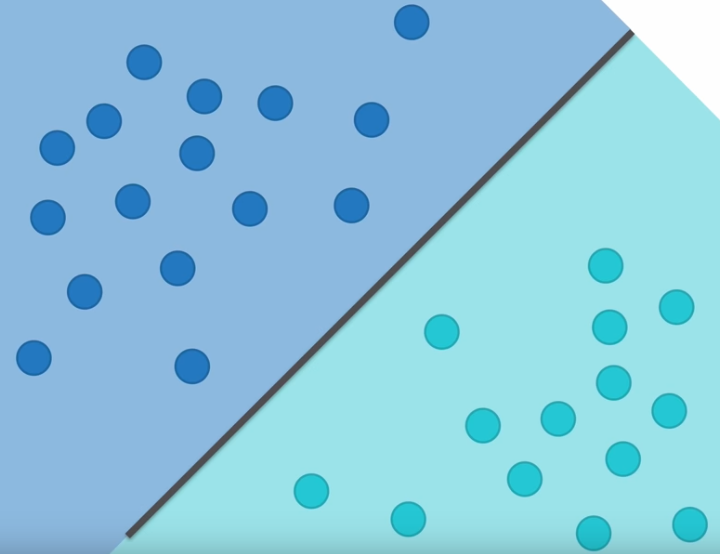

# SVR Support Vector Linear Regression

## Support Vector Machines

SVM è un classificatore, cioè: dato per esempio un set di punti, alcune possibili classificazioni sono:

SVM è un modello che meglio splitta le due sezioni:

Il miglior split è quello che crea il (margine più largo) percorso più largo possibile tra i due set.

**L'obbiettivo è massimizzare il margine** lasciando i punti fuori dal margine: è un problema di ottimizzazione.

Viene risolto usando la tecnica di moltiplicazione di Lagrange.
