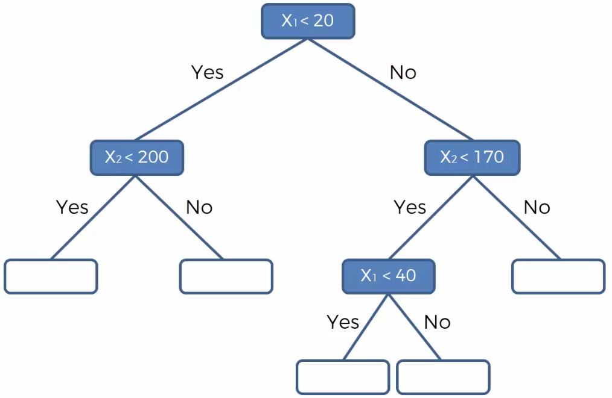

# Alberi decisionali

1. alberi di classificazione
2. alberi di regressione

## Alberi decisionali di regressione

Rappresentazione dei dati: $X_1,X_2 → y$.

Un algoritmo di regressione applicato su questo set plottato con punti verrebbe suddiviso in tante porzioni, tipo:

Per tentare di aumentare l'informazione che rappresentano i dati.

Il calcolo di $y$ date $X_1,X_2$ è graficamente interpretato come il calcolo di una terza dimensione.

La suddivisione in alberi (sezioni) è influente perchè la $y$ di una nuova coppia di variabili $X_1,X_2$ è stimata come media aritmetica delle y di una stessa sezione.

La media è stimata in questo modo:

