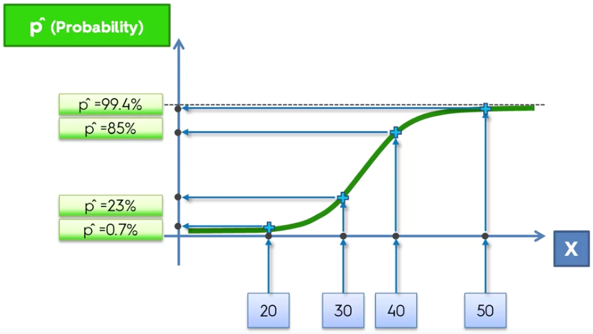

# Logistic regression

Nella logistic regression vogliamo stimare un modello sapendo che si è verificata una certa azione precedente.

Per dare un senso al grafico a sinistra, possiamo pensare che esista una probabilità di intraprendere l'azione considerata, compresa tra 0 e 1.

La retta di regressione lineare applicata al grafico `Action(Y/N)` di per sè non ha molto senso, ma trasformandola con una funzione sigmoide si ottiene un grafico sensato in grado di rappresentare una distribuzione di probabilità.

> **Funzione sigmoide**: Funzione matematica che produce una curva avente andamento a S.

Il calcolo della variabile dipendente avviene in questo modo:

Se X rappresenta l'età e y la probabilità di fare un'azione, si vede come un 20enne ha probabilità 0.7 di fare una certa cosa rispetto al 50enne che invece ha il 99.4% di probabilità.

Per poter suddividere il dataset in:

- **1**: quelli che compiono l'azione
- **0**: quelli che non la compiono

si decidere una probabilità soglia, tipo 50%, e si stabilisce che chi ha probabilità inferiore a 50% allora viene proiettato sulla retta 0 perchè poco probabile, mentre chi è superiore al 50% viene proiettato sulla retta 1.

