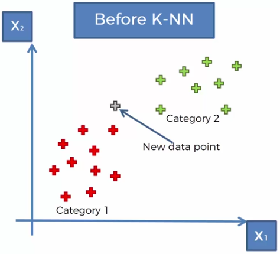
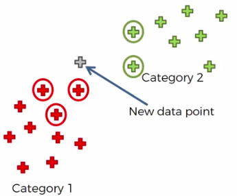

# K Nearest Neighbour

Abbiamo due categorie di dati, ad esempio verde e rosso.

Si aggiunge un nuovo dato, questo a quale categoria appartiene?
L'algoritmo è in grado di assegnare il dato ad una categoria.

## Step

1. scegli un numero K
2. prendi i K nodi più vicini a quello nuovo
3. tra questi k, conta quanti ce ne sono per ogni categoria
4. assegna il dato alla categoria dove ne hai contati di più
5. fine

### Esempio

Con $k=5$ la nuova osservazione diventa rossa.

