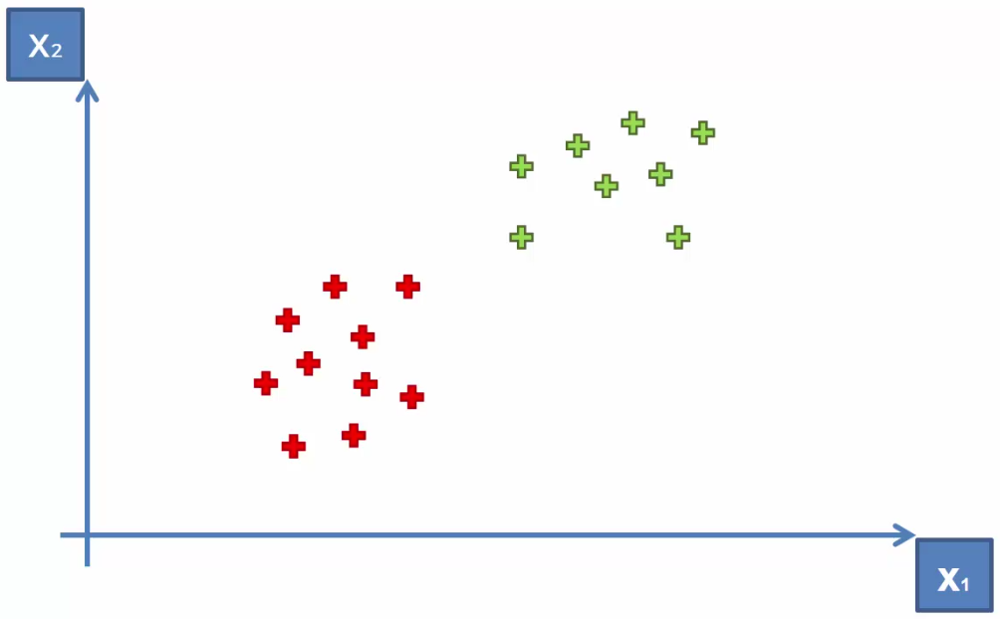
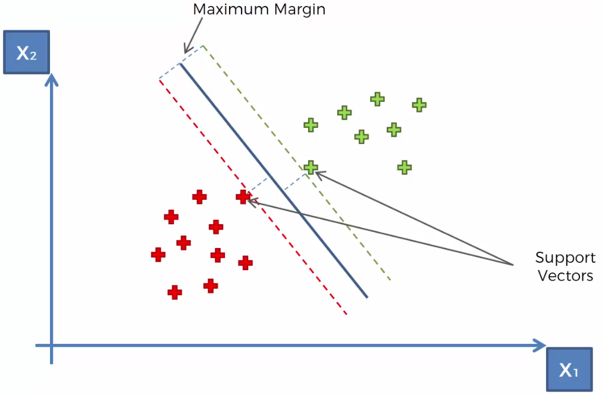

# SVM Support Vector Machines

Si parte da un dataset di punti in uno spazio bidimensionale in cui i punti sono già classificati.

Questo algoritmo permette di tracciare una linea in grado di separare le due aree di classificazione (verde e rosso).

Essendo un **classificatore lineare** la linea di separazione è una retta tracciata in modo tale da massimizzare il margine tra le due aree.

I due punti che stabiliscono la distanza minima dalla retta, e quindi l'ampiezza del margine, si chiamano *vettori di supporto*.

Tutte le ossevazioni (i punti) che riesiedono a destra della retta sono classificati come verdi, gli altri sono rossi.
