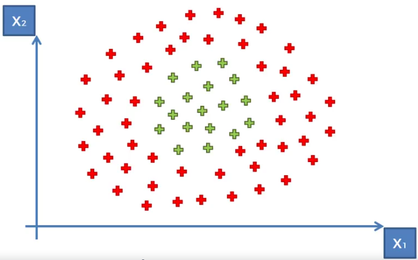
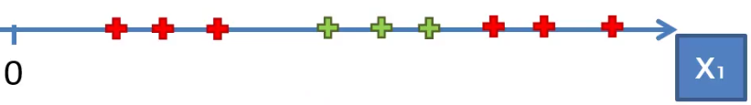
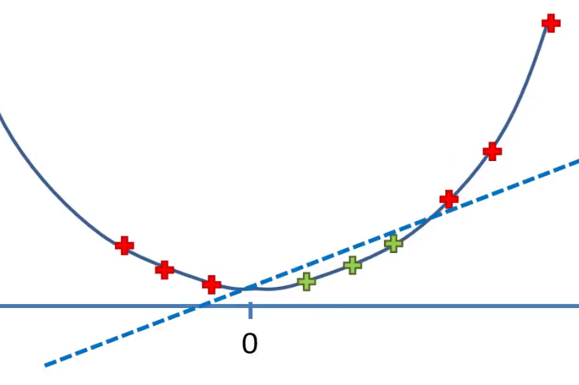
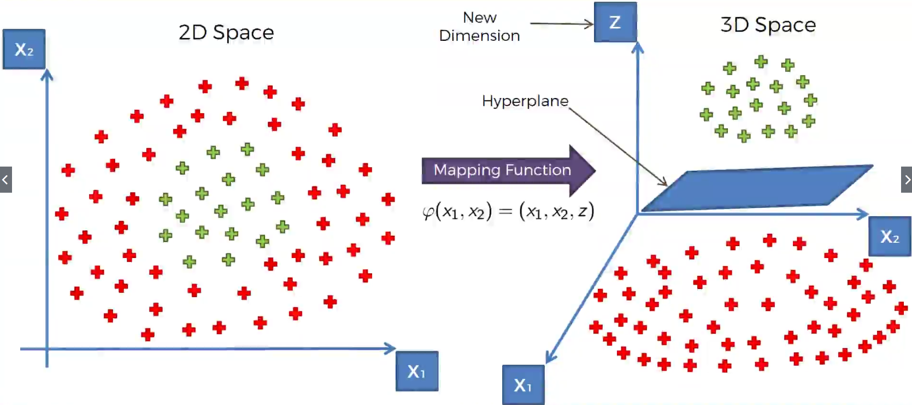
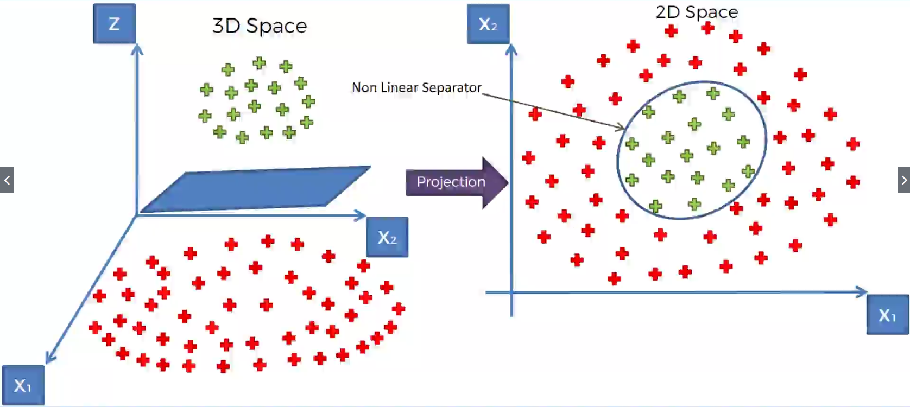
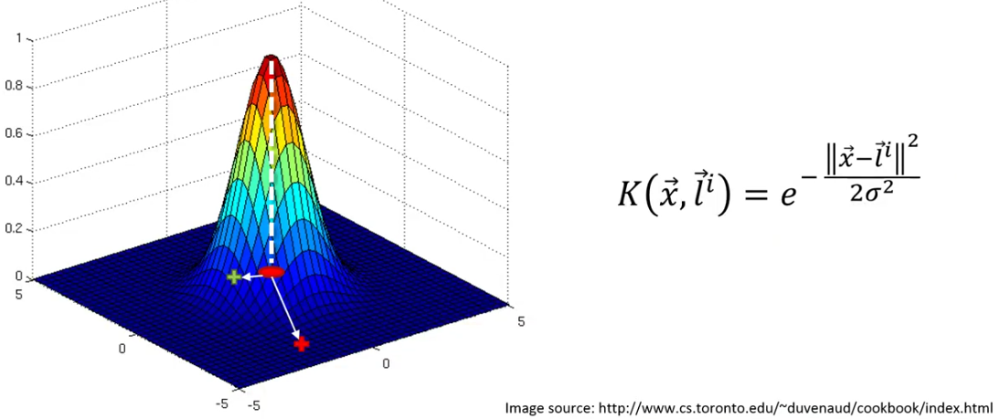
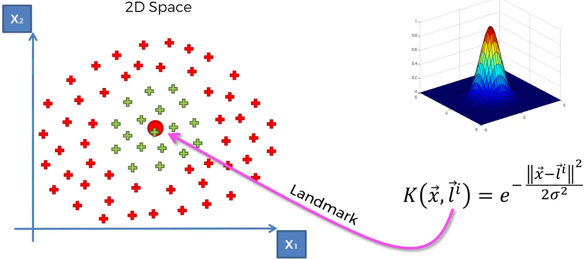
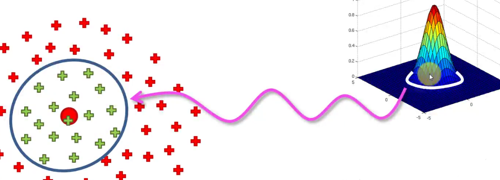
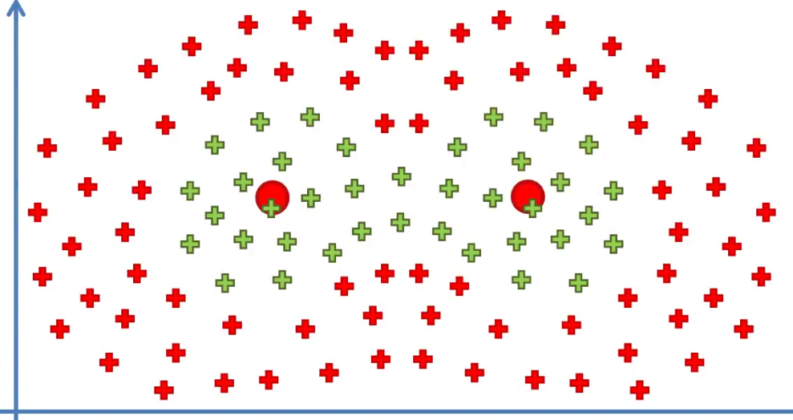

# Kernel SVM

Sono stati visti alcuni classificatori lineari che classificano dei punti dividendoli in due aree grazie ad una retta.

Cosa succede quando non è possibile tracciare una retta?

Ogni retta tracciabile non è in grado di separare le due classi: **i dati non sono linearmente separabili**.

## Idee

Una possibilità è aggiungere una terza dimensione ai dati (ad esempio una profondità) per poter rendere separabili linearmente i dati.

Il metodo Kernel invece è più semplice e risolve questo problema senza coinvolgere ulteriori dimensioni.

### Come mappare i dati ad una dimensione in più

Le osservazioni riportate in questa figura mostrano che questi dati non sono linearmente separabili perchè in una dimensione possiamo tracciare solo un punto. Tracciando un singolo punto non siamo in grado di separare tutti i verdi dai rossi.

La seguente funzione può essere trasformata:

1. ad ogni $Xi$ si toglie una stessa quantità, diciamo 5, in modo da shiftare tutti i punti a sinistra fino ad avere i rossi dietro a $X=0$
2. si eleva al quadrato e si proiettano i punti su una parabola
3. ora i punti sono separabili da una retta

### Lo stesso principio da 2D a 3D

Al termine del calcolo si riproietta eliminando la dimensione aggiunta:

Problema:

aggiungere una dimensione può diventare FOTTUTAMENTE costoso in termini di computazione.

Per risolvere questo problema si usa il metodo Kernel così si evita di mappare ad una dimensione maggiore.

## Il Kernel RBF Gaussiano

Il punto rosso sotto al cono rappresenta il centro della base e si chiama **landmark**.

Tutte le osservazioni all'interno della circonferenza vengono proiettate sul cono: lungo l'asse dell'altezza i punti hanno valore maggiore di 0 se sono all'interno della circonferenza, altrimenti uguale a 0.

$\sigma$ determina l'ampiezza della circonferenza: al crescere di $\sigma$ cresce anche la circonferenza.

Un problema complesso può essere rappresentato come somma algebrica di più kernel RBF gaussiani:

## Tipi di funzioni Kernel

Alcune delle più usate sono:

1. Kernel RBF Gaussiano
2. Kernel sigmoide
3. Kernel polinomiale

