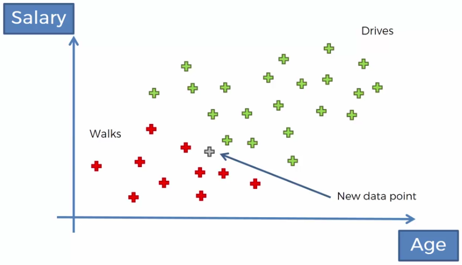
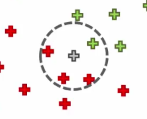
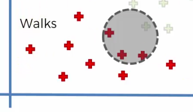

# Teorema di Bayes

$$P(A|B) = \frac{P(B|A)*P(A)}{P(B)}$$

$P(A|B)$: indica la probabilità che si verifichi A sapendo che si è verificato B.

## Naive Bayes classifier

Dato un set di osservazioni rappresentato in due variabili, si vuole capire come classificare un nuovo dato.

Ad esempio si vuole prevedere chi va a lavoro a piedi e chi in macchina in base al saraio e all'età.

Step 1:

- $P(Walks|X)=\frac{P(X|Walks)*P(Walks)}{P(X)}$
  - $nRossi / nVerdi$
- $P(X)$ si calcola **tracciando un cerchio attorno al nuovo dato** e contando rossi e verdi all'interno:  
  *P(X) = n punti nel cerchio / n punti totali*  
   
- *P(X|Walks) = numero di osservazioni simili nel cerchio / numero di osservazioni simili totali* 
  

Step 2:

- $P(Drives|X)=\frac{P(X|Drives)*P(Drives)}{P(X)}$

Step 3:

- $P(Walks|X)$ VS $P(Drives|X)$

### Indipendenza delle variabili

Le variabili coinvolte nel calcolo devono essere indipendenti.
Nell'esempio considerato, tra età e salario potrebbe esserci qualche tipo di correlazione.

Questo classificatore funzione anche se le variabili non sono davvero indipendenti.

### Cosa succede quando ci sono più di 2 classi

Considera una classe rispetto a tutte le altre, in modo da ricondurti ad averne solo 2.
