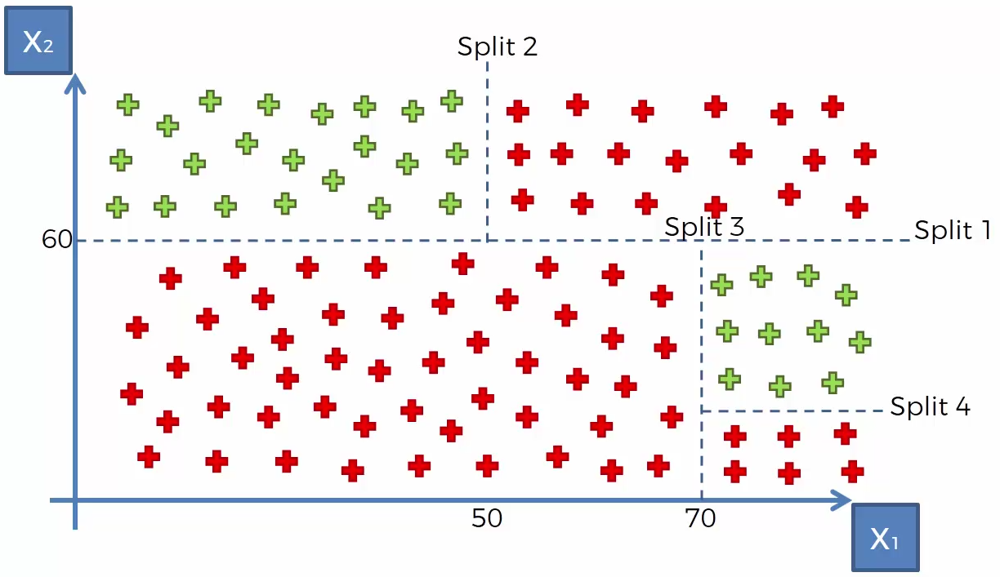
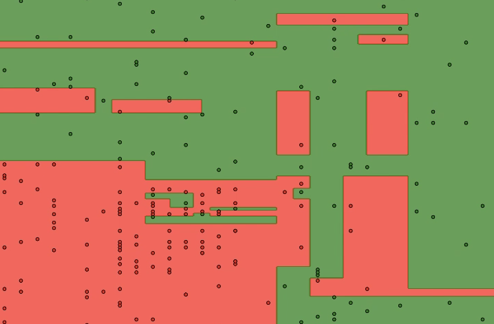

# Decision tree

CART

- Classification
- And
- Regression
- Trees

1. Classification trees
   Lavorano con dati di classificazione
2. regression trees
   Servono a prevedere il valore di variabili

## Decision tree

Un decision applica degli split secondo un determinato algoritmo per suddividere i dati.

Ad ogni split l'algoritmo prevede di massimizzare la quantità di dati raggruppati. In pratica ogni split suddivide i dati ma cerca di massimizzare l'informazione elargita per il nuovo subset.

**Non è un classificatore lineare!** Questo è un esempio di output dopo l'esecuzione degli split.

