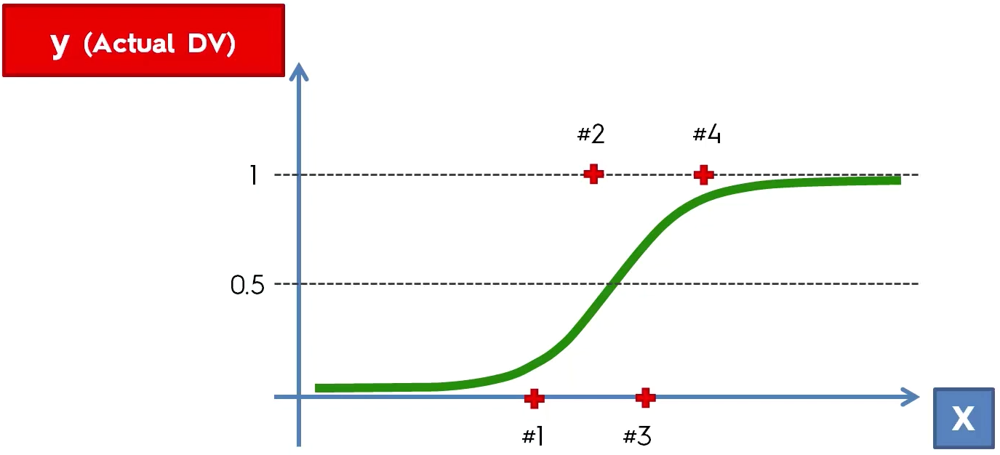
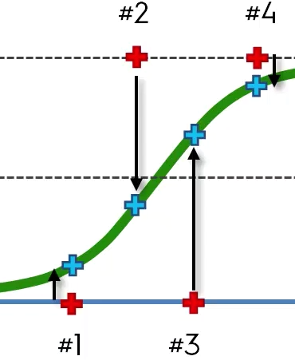
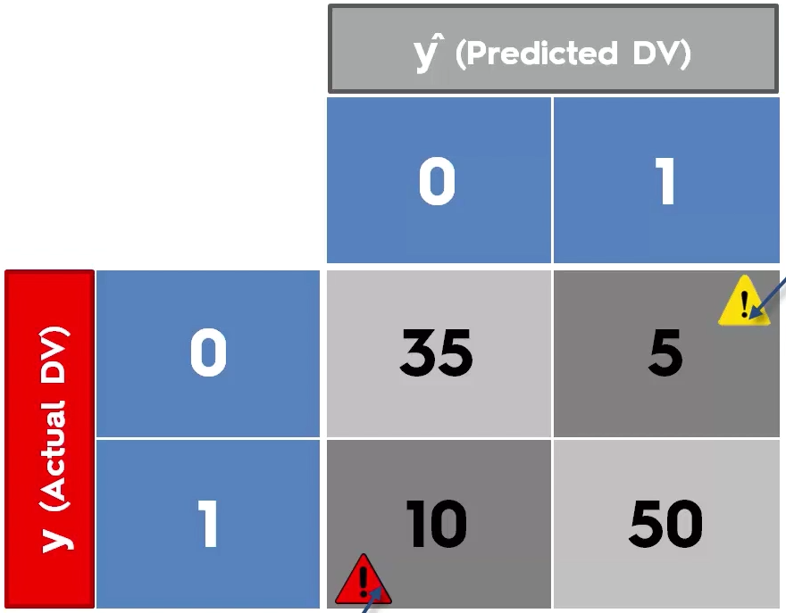
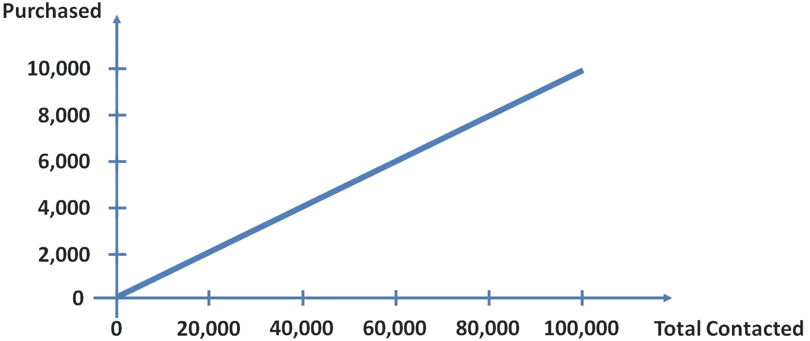
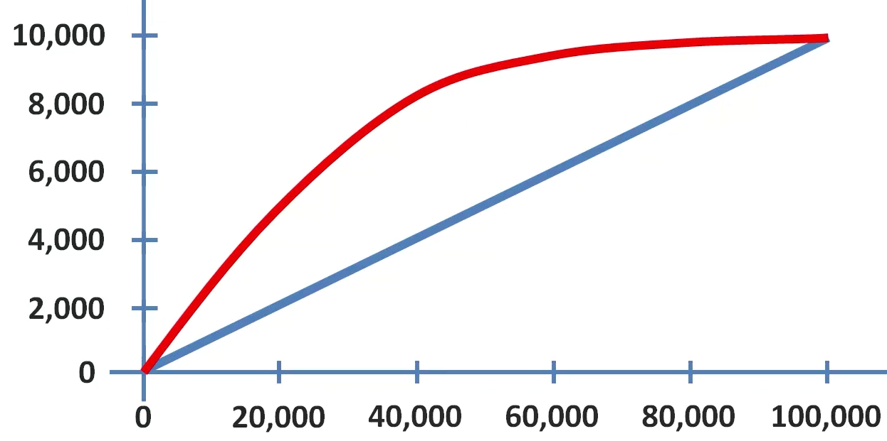
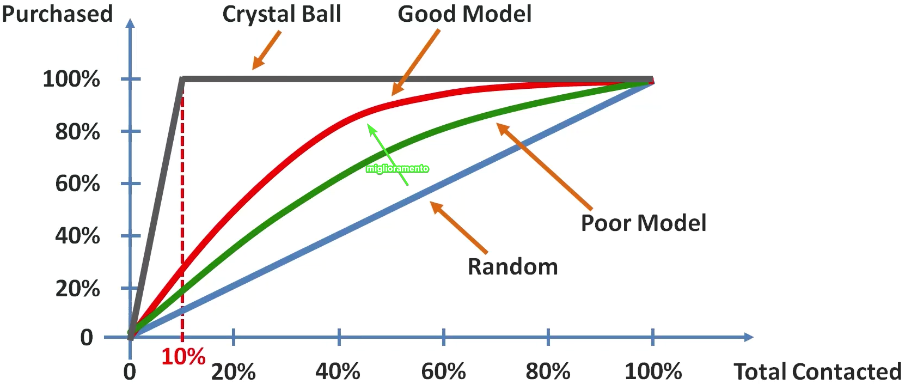
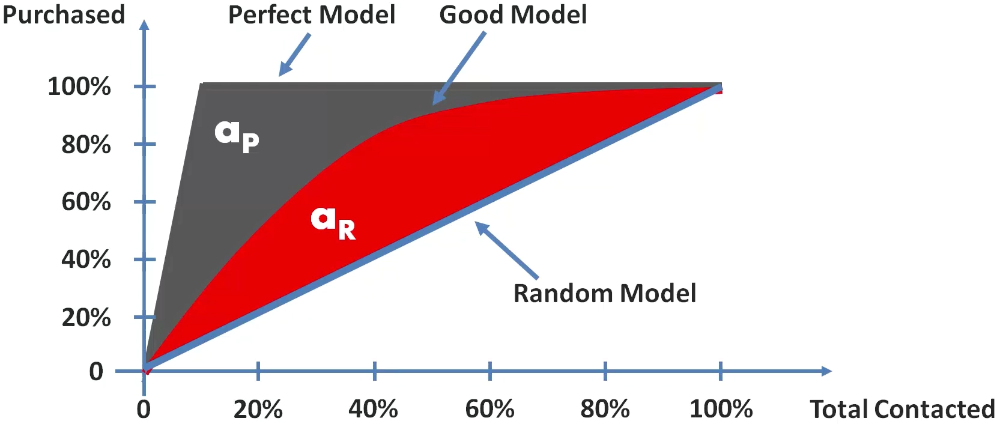
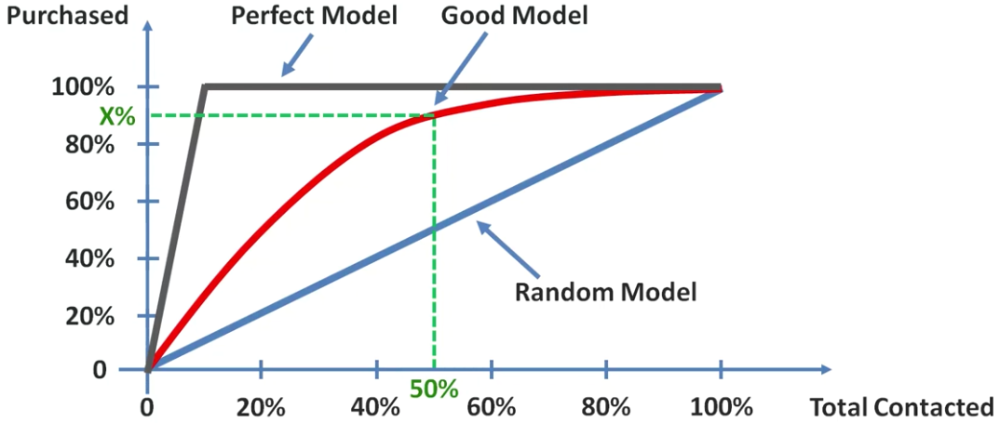

# Valutazione performance dei modelli di classificazione

## Falsi positivi e falsi negativi

Con la funzione logistic regression si era stabilito che

- $y > 0.5$ venivano calcolate come $\hat{y} = 1$
- $y < 0.5$ venivano calcolate come $\hat{y} = 0$

al solo scopo di rendere una probabilità un valore o 0 o 1.

Gli N valori di probabilità erano stati calcolati guardando N variabili indipendenti trasposti sulla funzione sigmoide.

Osserviamo lo stesso grafico della funzione sigmoide su $y$ che conosciamo, di cui cioè già sappiamo se l'utente avevano comperato:

Ci sono dei valori che il modello ha predetto male:

- **falso positivo**: #3
- **falso nevativo**: #2

## Matrice di confusione

- **00**: ($y$) qualcosa non doveva succedere, ($\hat{y}$) e infatti non è successo
- **01** **false positive**: ($y$) qualcosa non doveva succedere, ($\hat{y}$ ) ma è successo
- **10** **false negative**: ($y$) qualcosa doveva succedere, ($\hat{y}$) ma non è successo
- **11**: ($y$) qualcosa  doveva succedere, ($\hat{y}$) e infatti è successo

### Indici

#### Indice di correttezza

$$corretti / totale$$

#### Indice di errore

$$errati / totale$$

## Profilo di accuratezza cumulativo (CAP)

Esempio:

Un certo negozio fa delle promozioni in cui invia dei campioni di prodotto.

Empiricamente, inviando i campioncini a persone completamente casuali, è stato visto che soltanto il 10% alla fine compera, cioè:

Se vuole massimizzare il numero di compratori minimizzando il numero di persone contattate e quindi di campioni inviati.

Ipotizzando di avere una qualche sorta di modello per la selezione delle persone giuste, si otterrebbe una curva del genere:

Peggiore è il modello e più diventa simile al modello random, se non addirittura peggio (andando sotto alla retta del modello random).

Migliore è il modello e più la curva è accentuata e diventa ripida nella prima metà. Il modello ottimo permette di selezionare soltanto 10.000 persone, cioè il 10% del totale, per riuscire a vendere i 10.000 prodotti prefissati.

### CAP Accuracy Ratio

Per calcolare il livello di accuratezza del proprio modello (good model) rispetto al modello ottimo,

si calcola il rapporto delle due aree coperte:
$$AR = a_R / a_P$$

più **AR** tende a 1 e meglio è perchè il modello buono tende a quello ottimo

Calcolare le aree è un casino, c'è un modo più semplice e quasi altrettanto valido: si considera il 50% sull'asse orizzontale e si controlla il valore ottenuto sull'asse verticale, se è maggiore di 60% allora va bene, altrimenti non va bene e il modello considerato è pessimo.

- se $X\% < 60\%$ il modello è inutile
- se $60\% \leq X\% < 70\%$ il modello è nella media
- se $70\% \leq X\% < 80\%$ il modello è nella buono
- 💚 **se $80\% \leq X\% < 90\%$ il modello è molto buono**
- ❌ se $X\% \geq 90\%$ il modello è trobbo buono e sicuramente c'è **overfitting**
