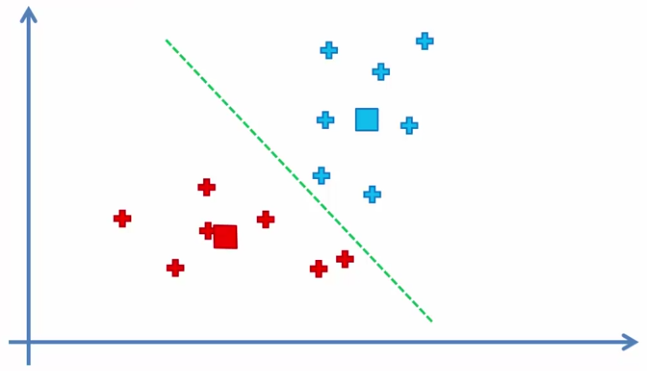

# K-means clustering

K-means è un algoritmo che permette di suddividere i dati in gruppi o categorie.

#### step 1

scegli il numero k di cluster

Es: $k=2$

#### step 2

seleziona a caso K punti (anche non del dataset) che saranno i centri dei K cluster.

#### step 3

assegna ogni punto al centro del cluster *più vicino*

- bisogna capire cosa si intende per "*più vicino*" (la distanza Euclidea è un esempio ma non l'unica opzione)

#### step 4

ricalcola e riposiziona il nuovo centroide di ogni cluster

#### step 5

Riassegna ogni punto al centroide più vicino (ripete lo step 3) e ripete il punto 4 se c'è stato qualche spostamento di punti in altri cluster, altrimenti ha finito.

I punti indicati vengono riassegnati a cluster differenti:

Ripeti in ordine:

1. calcola il nuovo centroide
2. riassegna i punti ai cluster altrimenti FINE

**FINE**.

Al termine delle iterazioni questo è il risultato:

## Trappola dell'inizializzazione casuale

A seconda di come vengono scelti i centroidi è possibile formare cluster completamente differenti:

### 1

### 2

La numero 1 è più naturale e potrebbe essere quella corretta.

Per evitare di incorrere in questo tipo di situazione è stato ideato l'**algoritmo k-means++**.

## Scegliere il numero di cluster

Come si stabilisce come performa un determinato numero di cluster rispetto ad un differente quantitativo di cluster su uno stesso dataset?

$$WCSS = \sum cluster (\sum DISTANZA(C, P_i)^2)$$

All'aumentare dei cluster diminuisce la distanza quadratica totale tra i punti.

### Metodo Elbow

E' possibile rappresentare graficamente il numero di cluster e il relativo valore *WCSS:*

Il valore *WCSS* diminuisce sempre, ma non in maniera costante. E' buona norma scegliere (a spanne) quel determianto valore dove si vede che aumentare il numero di cluster porta ad una **diminuzione** di *WCSS* molto **poco significativa**.

