# Clustering gerarchico

Tipi:

1. agglomerativo
2. divisivo

#### Step 1

ogni punto diventa un cluster: si formano N clusters.

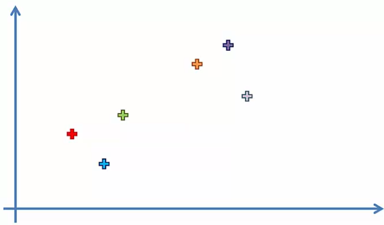

#### Step 2

I due **punti** più vicini vengono raggruppati in un singolo cluster (N-1) cluster

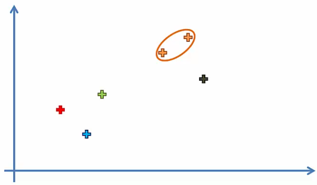

#### Step 3

I due **cluster più vicini** vengono raggruppati in un singolo cluster (N-1) cluster

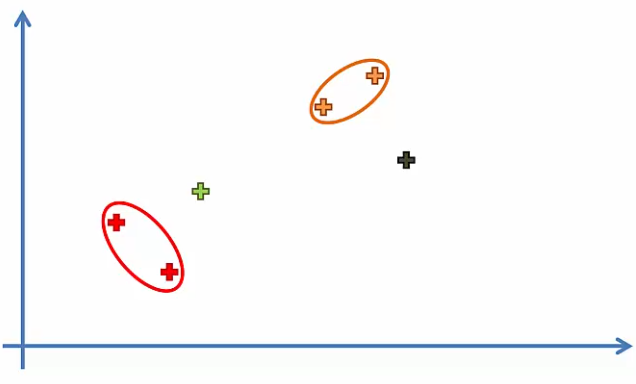

> come si calcola la distanza tra due cluster?

#### Step 4

ripeti step 3 fino ad ottenere un unico cluster

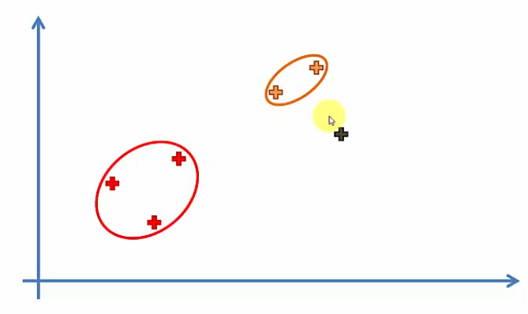

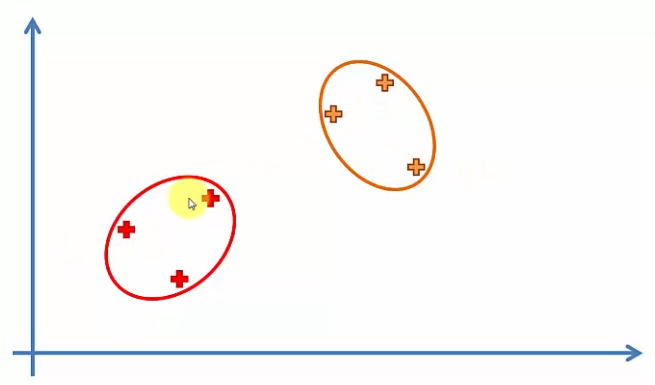

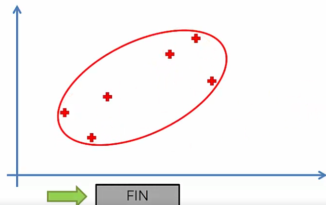

FINE.

## Dendogramma

### Esempio di dendogramma

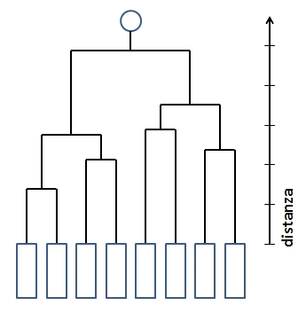

### step 1

Ogni punto è un cluster a sè stante.

### step 2

I punti P2 e P3 sono in uno stesso cluster e quindi si collegano con una linea orizzontale. L'altezza tra la linea orizzontale che li collega e l'asse orizzontale rapppresenta la distanza (ad esempio euclidea) tra i due punti/cluster.

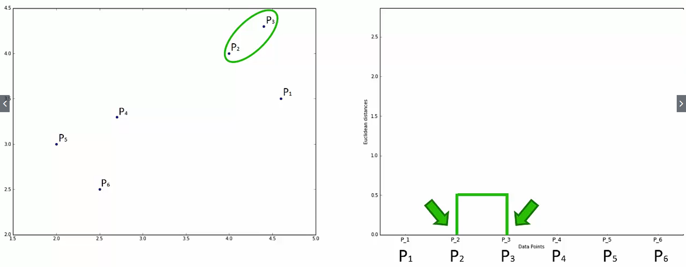

### step 3

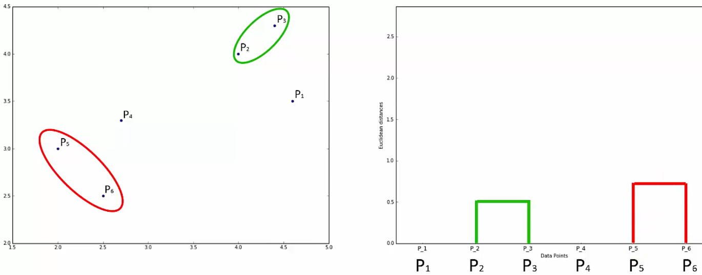

P5 e P6 sono collegati e hanno un'altezza maggiore rispetto alla coppia precedente perchè la loro distanza è maggiore.

### step 4

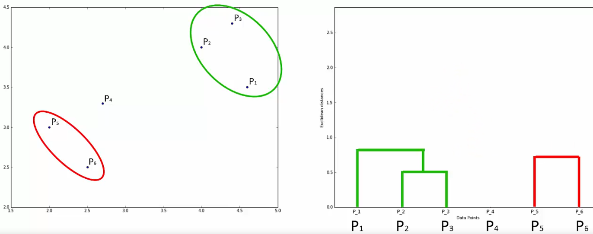

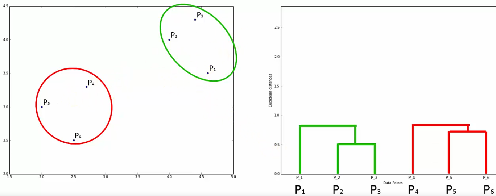

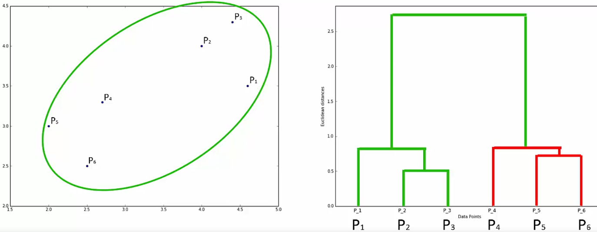

## Soglia di diversità

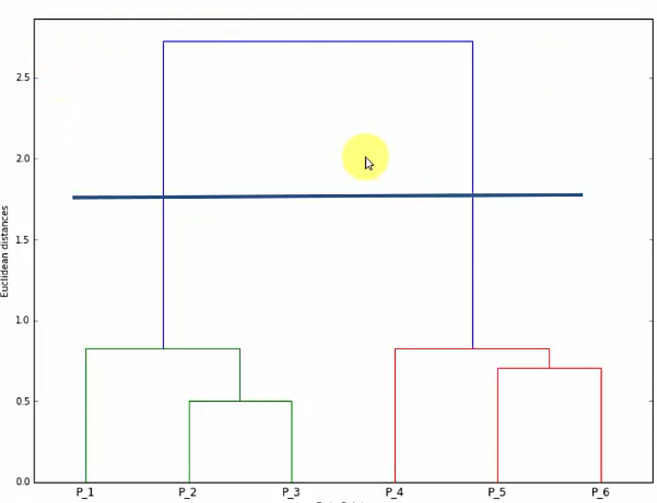

Le altezze rappresentano le distanze tra i cluster, quindi le *diversità* rispetto ai cluster. Maggiore è la distanza e più sono diversi.

E' utile stabilire una soglia, threshold, graficamente rappresentata da una linea orizzontale nel dendogramma, che stoppa il raggruppamento in cluster di cluster minori evitando così di formare gruppi troppo eterogenei.

Nella foto abbiamo due cluster, perchè l'ultimo supera la soglia definita.

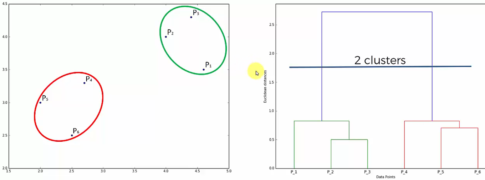

Esempio con 4 clusters:

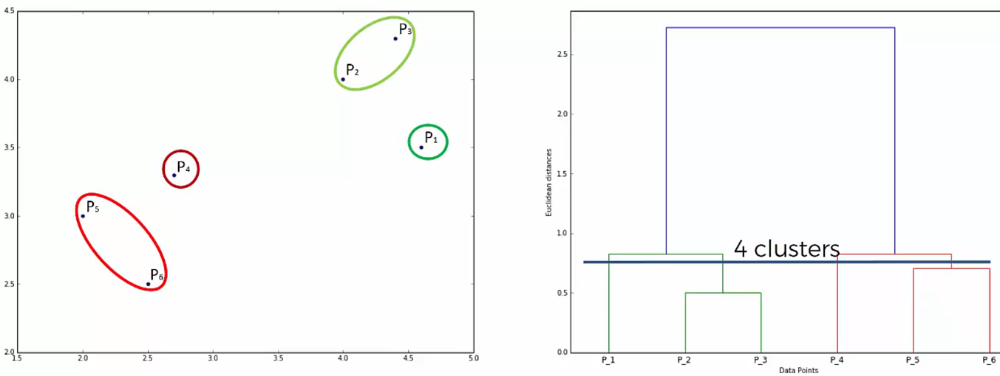

## Come trovare un numero di cluster ottimale

Come si setta un threshold adeguato?

Immaginando di prolungare ogni linea orizzontale fino all'asse verticale, si taliga dal threashold la linea verticale più lunga che non è tagliata da alcuna linea orizzontale.

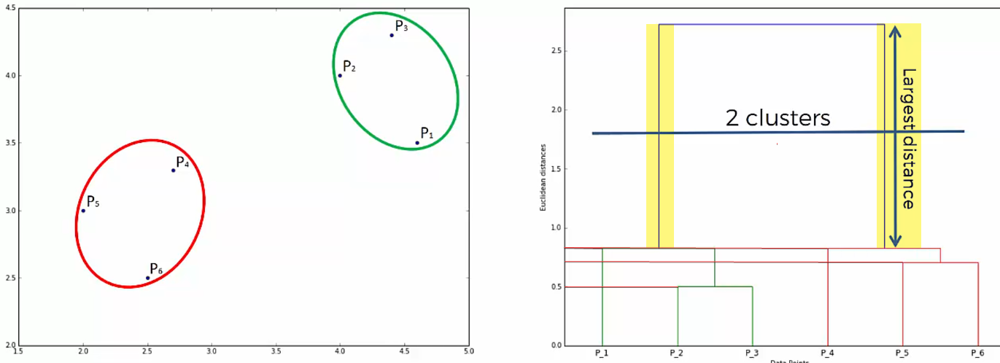
