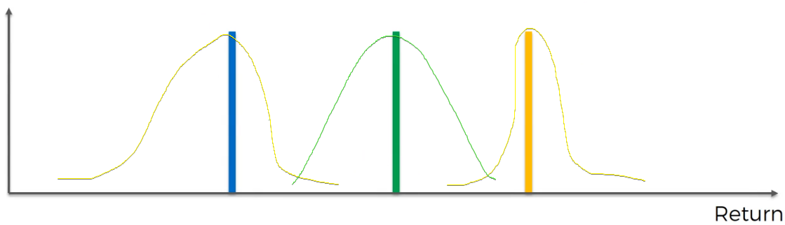
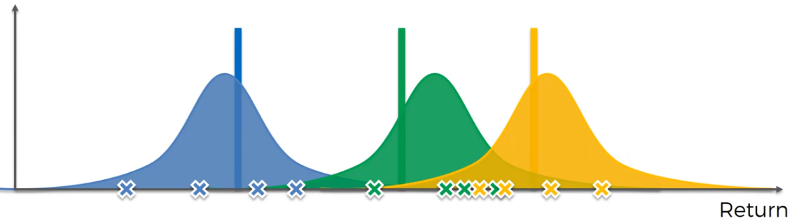
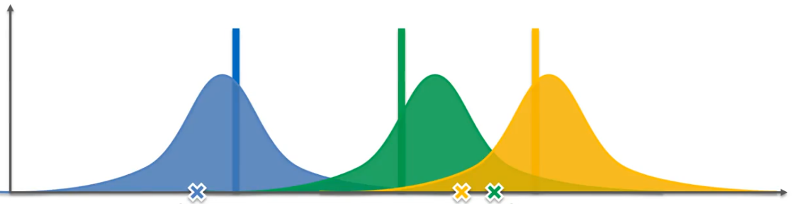

# Thomson Sampling Algotirhm

Questo problema richiama quello di UCB in cui ogni slot machine ha la sua distribuzione di probabilità e si vuole massimizzare la vincita sul lungo periodo.

> UCB: upper bound confidence

Ogni slot machine ha la sua distribuzione di probabilità.

Mano a mano che vengono vengono usate le slot machine, l'algoritmo comincia a creare le distribuzioni.

Queste distribuzioni a campana **rappresentano dove ci aspettiamo che sia il valore atteso** sul lungo periodo, ma non sono le distribuzioni del vero e proprio valore atteso, infatti sono costruite con le osservazioni che vengono raccolte mano a mano.

Immaginando di aver raccolto una sola osservazione per slot machine, l'algoritmo posiziona il punto osservato sotto alla campana in modo non casuale, ma con una probabilità che cala allontanandosi dal centro.

(Sul lungo andare la maggior parte delle osservazioni saranno attorno al centro).

Dopo ogni osservazione i grafici vengono modellati fino ad ottenere quelli finali.
