# Artificial Neural Networks

## Il neurone

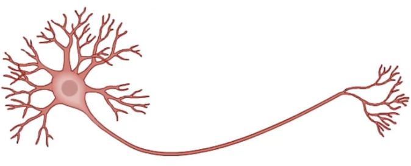

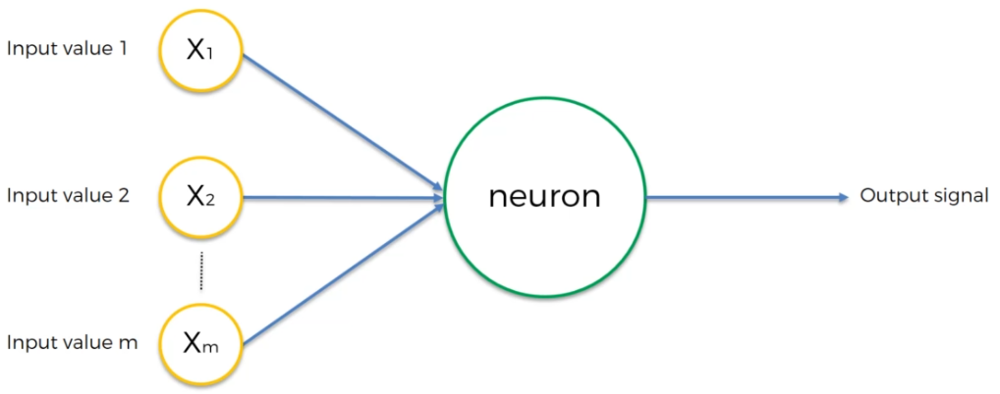

In input abbiamo le variabili indipendenti $X_i$ per ogni singola osservazione.

Le $X_i$ vanno:

- **standardizzate**: media 0 varianza 1
- o **normalizzate**

L'output value può essere:

- continuo
- binario
- una categoria

Per ogni singola osservazione, abbiamo tante $X_i$ e un solo output $y$.

### Sinapsi

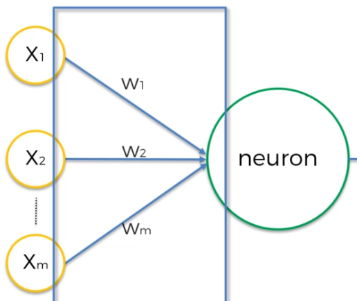

Le sinapsi rappresentano i collegamenti tra gli input e gli algoritmi.

Ogni sinapsi ha un peso $W_i$. Con ogni retraining vengono aggiustati i pesi.

### Cosa accade nel neurone

1. Viene calcolata la sommatoria delle $X_i$ per i rispettivi pesi $W_i$: $\sum{W_i X_i}$
2. viene applicata la funzione di applicazione:  $\phi (\sum{W_i X_i})$

## Funzione di attivazione

Per ora vediamo 4 tipi di funzioni di attivazione:

### 1. Threshold function

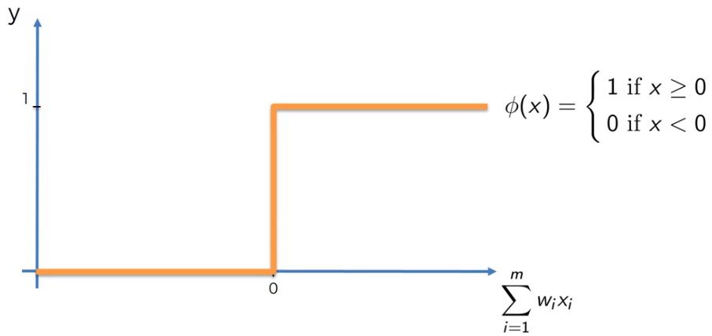

### 2. Sigmoid function

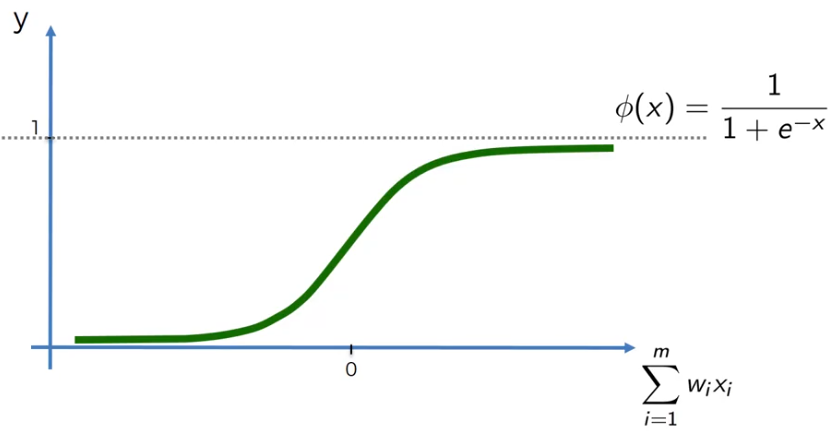

### 3. Rectifier function

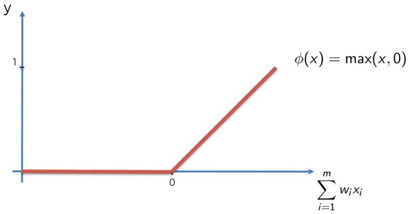

### 4. Tangente iperbolica

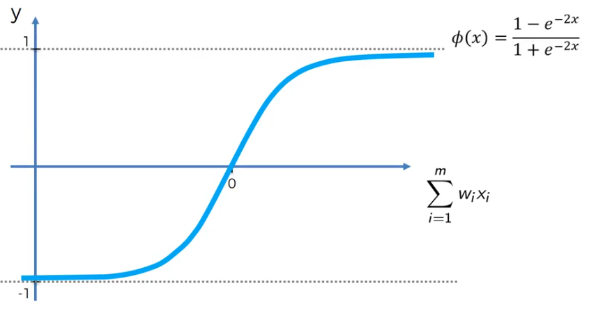

## Possibile scenario di esempio

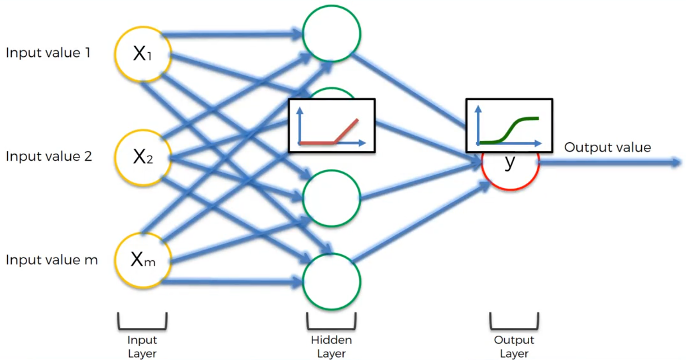

## Come funzionano le reti neurali

*Immaginiamo di voler prevedere il costo di una casa sulla base delle sue caratteristiche.*

I dati vengono inviati ad ogni neurone dove vengono analizzati a seconda dei loro pesi. E' anche possibile che determinati pesi siano 0 (sinapsi tratteggiate o mancanti).

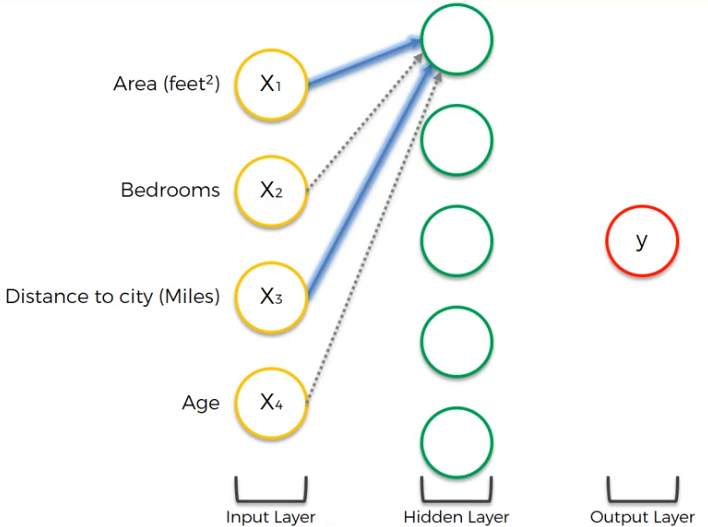

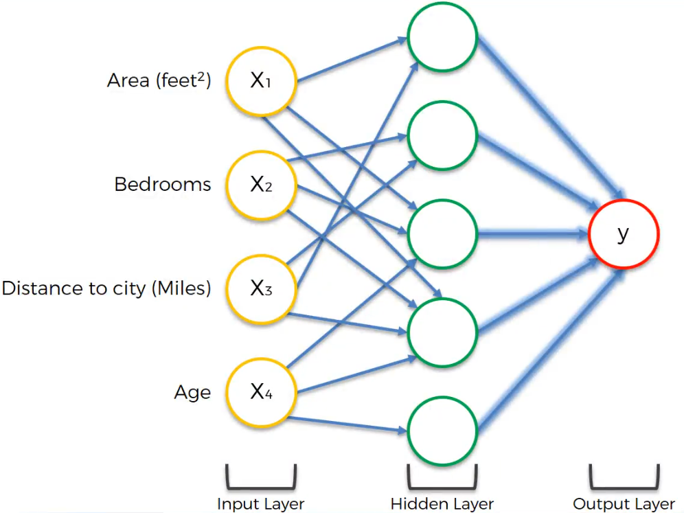

## Come imparano le reti neurali

Immaginiamo una rete neurale che ha ottenuto un valore di output applicando la funzione di attivazione sulla sommatoria $\sum(X_i W_i)$: il valore ottenuto in output non è $y$ ma $\hat{y}$ perchè è una stima ed è confrontabile con $y$, il valore atteso.

$$C = 1/2 (\hat{y}-y)^2$$

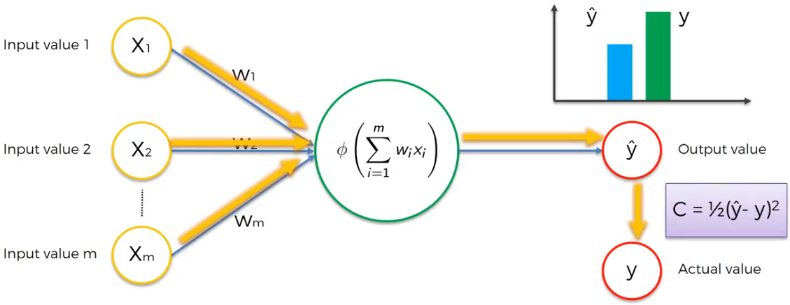

$C$ permette di avere un'idea sull'errore ottenuto.

Il confronto viene usato come feedback per sistemare i pesi $W_i$ usati in precedenza e si ripete il loop fino ad avere dei pesi funzionanti.

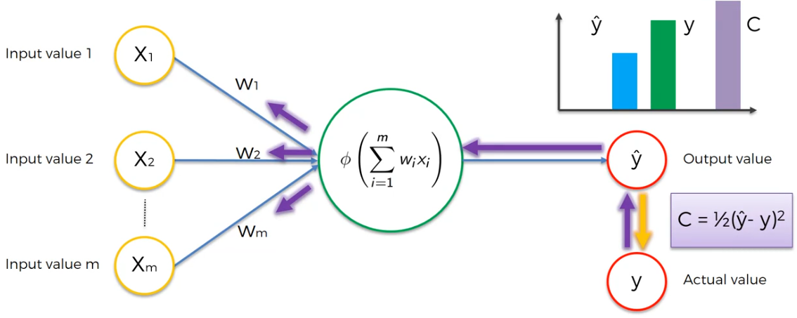

**Tutto questo passaggio viene applicato su ogni singola riga dei dati di input**! Il passaggio in viola si chiama **back propagation**.

## Gradient descent

Come si diminuisce l'errore $C = 1/2 (\hat{y}-y)^2$ durante la fase di back propagation?

1. approccio brute force: prova dei pesi e trova il migliore 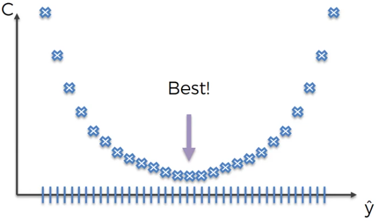
2. approccio bactch gradient descent: guardando la curva della parabola dell'errore C, controlla la derivata. In base al segno della derivata è possibile capire in quale porzione della curva ci si sta muovendo: 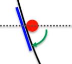 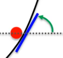  
I pesi sono ricalcolati dopo aver computato tutte le righe. Serve una funzione convessa.
3. approccio **gradient descent stocastico**: I pesi sono ricalcolati dopo ogni singola riga calcolata. Non serve più una funzione convessa perchè aumenta di molto la possibilità di trovare un minimo globale.

## Backpropagation

Backpropagation è un algoritmo che permette di aggiustare tutti i pesi simultaneamente.

## Train an ANN con Gradient Descent stocastico

1. Inizializza i pesi in modo casuale con valori tendenti a 0.
2. Fornisci in input la prima colonna delle features (`X[0]`)
3. Attiva i neuroni da sinistra a destra tenendo conto dei pesi delle sinapsi fino all'output $\hat{y}$
4. Misura l'errore tra $y$ e $\hat{y}$
5. Propaga l'errore da destra a sinistra e aggiorna i pesi in base a quanto hanno influito sul risultato precedente
6. Ripeti gli step precedenti fino ad ottenere un valore di output accettabile.
