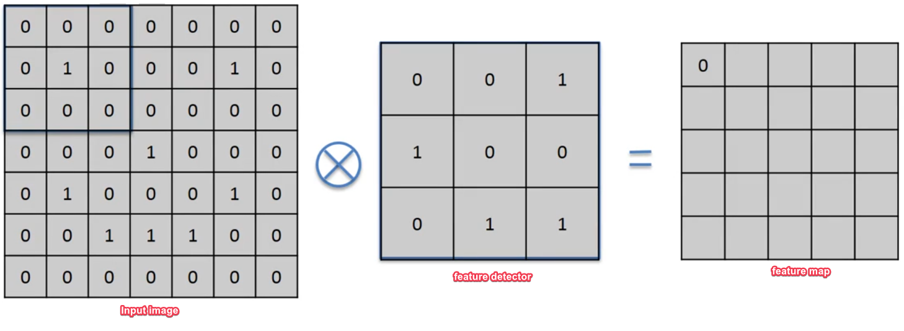
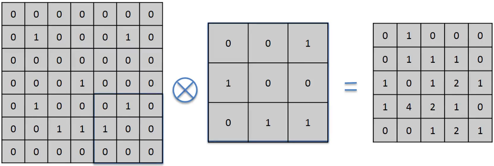
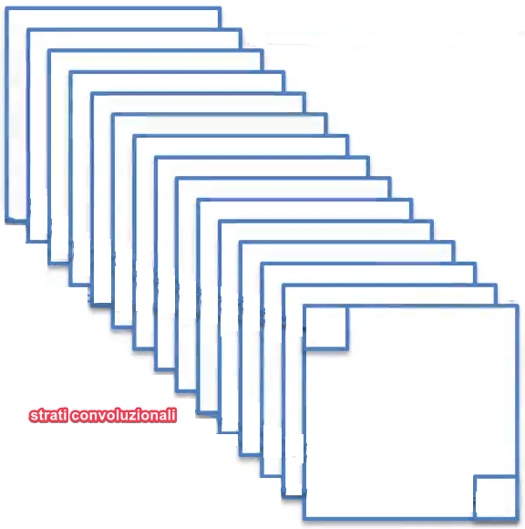
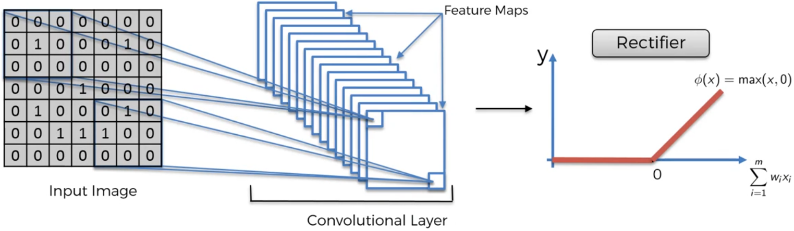
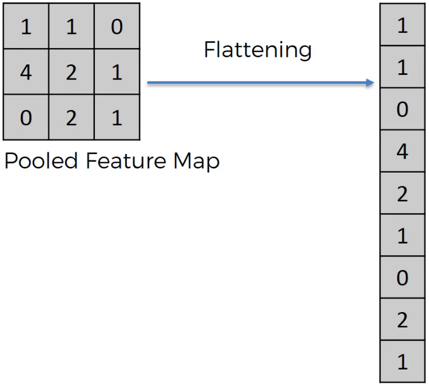
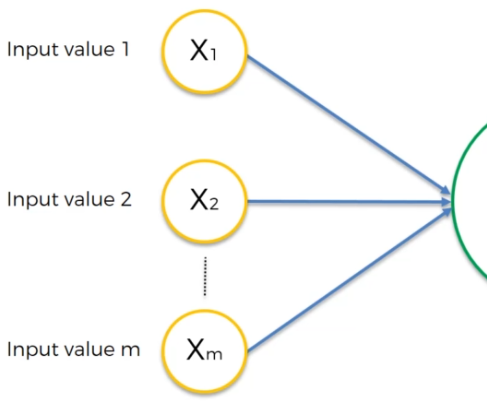
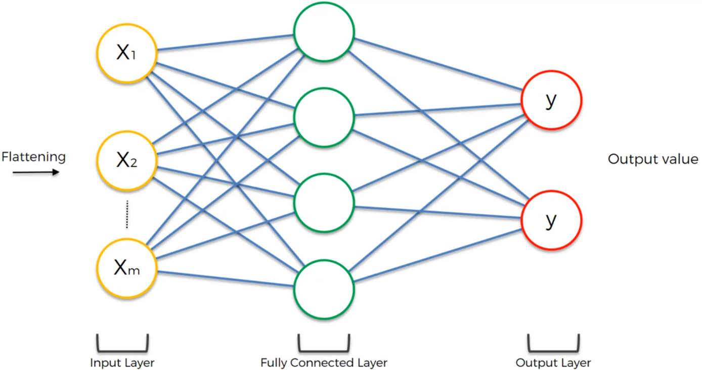
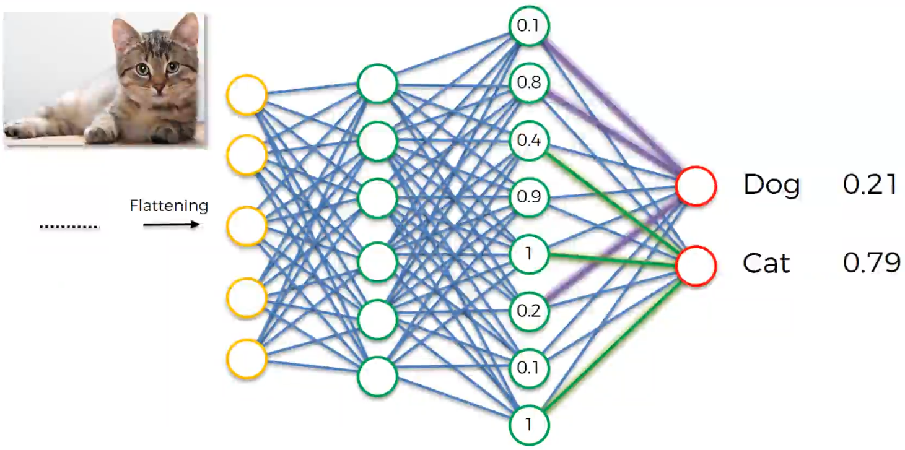
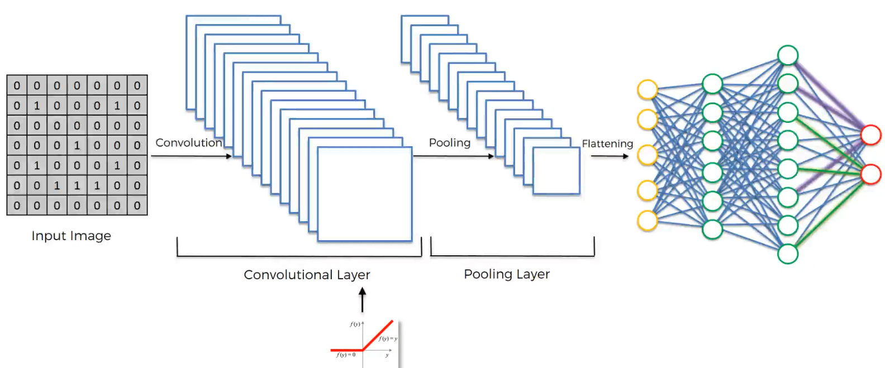

# Convolutional Neural Networks

Le reti neurali convoluzionali sono una classe del deep learning applicata solitamente nel riconoscimento delle immagini.
Sono strati di nodi interconnessi tra di loro, con anche strati in grado di applicare filtri per riconoscere determinate caratteristiche dell'immagine analizzata.

Un'immagine in bianco e nero viene semplificata ad un array bidimensionale di 0 e 1, dove (ad esempio):

- 1: indica nero
- 0: indica bianco

Un'immagine a colori viene convertita ad un array tridimensionale in cui ogni cella contiene un valore tra 0 e 255 per rappresentare l'intensità del colore. Ogni layer rappresenta un filtro in grado di percepire un determinato colore, tipo rosso, blu e giallo.

La combinazione dei vari colori ottenuta tra i vari strati fornisce un colore come computazione dei vari strati.

Steps:

1. Convolution
2. Max Pooling
3. Flattening
4. Full Connection

## STEP 1.a: Convoluzione

1. **immagine di input** come tabella di 0 e 1
2. **matrice feature detector** (feature detector, kernel, filter)
   - è una matrice tipicamente 3x3
3. **matrice feature map** ottenuta moltiplicando ogni blocco dell'immagine di input con la matrice feature detector

La matrice feature map viene generata in questo modo:

Ogni singola cella è calcolata come somma del risultato della moltiplicazione di ogni cella della input image con quella della feature detector.

In pratica,

`feature_map[0] = 0` perchè somma di:

- `input_image[0][0] * feature_detector[0][0] +`
- `input_image[0][1] * feature_detector[0][1] +`
- `input_image[0][2] * feature_detector[0][2] +`
- `input_image[1][0] * feature_detector[1][0] +`
- `input_image[1][1] * feature_detector[1][1] +`
- `input_image[1][2] * feature_detector[1][2] +`
- `input_image[2][0] * feature_detector[2][0] +`
- `input_image[2][1] * feature_detector[2][1] +`
- `input_image[2][2] * feature_detector[2][2]`

Il risultato finale è

Cosa è stato ottenuto:

1. la dimensione dell'immagine è stata ridotta (rende più veloce processarla)
   - l'immagine risulta più piccola perchè è così che guardiamo nella realtà. Cerchiamo le feature, i dettagli, non tutto contemporaneamente.
2. si costruiscono tante matrici di feature, ciascuna per capire determinate caratteristiche dell'immagine 
3. è l'algoritmo di machine learning che decide quali filtri sono significativi per riconoscere determinate immagini.

## STEP 1.b: ReLU Layer

La funzione rectifier serve ad aumentare la non linearità nella rete convoluzionale.

## STEP 2: Max pooling

Come può una macchina riconoscere con successo uno stesso oggetto con sfondi different e messo in posizioni differenti?

La proprietà **invariante spaziale** permette ad una feature di essere riconosciuta proprio in situazioni e posizioni diverse. In pratica una feature viene riconosciuta con una certa flessibilità.

Il max pooling è un processo che si occupa proprio di questo.

Costruisce la **Pooled Feature Map** proprio come si costruisce la matrice di feature, ma il valore scritto è il valore massimo trovato nella sezione osservata dell'immagine di input.

Ad esempio

|     |     |     |
| --- | --- | --- |
| 1   | 1   | 0   |
| 1   | 0   | 2   |
| 0   | 0   | 0   |

genera 2 perchè è il massimo.

Quello che succede è che viene mantenuto il pattern originale della foto ma si è comunque in grado di riconoscere feature simili in posizioni diverse. Infatti:

|     |     |     |
| --- | --- | --- |
| 1   | 1   | 0   |
| 1   | 0   | 2   |
| 0   | 0   | 0   |

genera 2

|     |     |     |
| --- | --- | --- |
| 1   | 1   | 2   |
| 1   | 0   | 0   |
| 0   | 0   | 0   |

genera 2

|     |     |     |
| --- | --- | --- |
| 1   | 1   | 0   |
| 1   | 2   | 0   |
| 0   | 0   | 0   |

genera 2

|     |     |     |
| --- | --- | --- |
| 1   | 1   | 0   |
| 1   | 0   | 0   |
| 0   | 0   | 2   |

genera 2

Le 4 immagini precedenti generano sempre lo stesso valore di output. E' così che la **pooled feature map** è in grado di ricondursi a matrici uguali anche se la matrice di partenza è lievemente diversa.

E' questa flessibilità dell'invariante spaziale.

## STEP 3: Flattening

In questo processo la matrice Pooled Feature Map viene scritta come array.

Lo scopo è poterlo fornire come input all'input layer della rete convoluzionale:

## STEP 4: Full connection

In questo step viene aggiunta una rete neurale artificiale a quello fatto fin'ora.

L'hidden layer deve essere *"fully connected"* nelle reti neurali convoluzionali.

Lo scopo della rete neurale è combinare gli input in molti più attributi per fare la classificazione.

> **NB**: nelle reti neurali convoluzionali è necessario avere più di un output.

Durante il back propagation vengono aggiustati i pesi ma anche le matrici feature detector.

Finito il training i nodi della rete neurale devono votare la classificazione, e i voti sono influenzati dai pesi del nodo.

## Riassunto

## Softmax & Cross-Entropy

`Softmax` è una funzione che permette di avere in output dei valori che sommati danno 1 e riduce di molto il numero di dimensioni del problema.

🔴 --> Dog --> 0.95

⭕ --> Cat --> 0.05

$$f_i(z) = \frac{e^{z_j}}{\sum_ke^{z_k}}$$

`Cross-entropy`

$$L_i = -\log{\frac{e^{f_{y_i}}}{\sum_je^{f_i}}}$$

oppure

$$H(p,q) = -\sum_x{p(x)\log{q(x)}}$$

è una funzione usata assieme a `softmax`. Permette di farsi un'idea sulle performance del modello.

### Come si applicano

Supponiamo di avere due classificatori di immagini che tentano di classificare 3 foto. Questi sono i risultati:

#### CNN 1

|       | $\hat{Dog}$ | $\hat{Cat}$ | $Dog$ | $Cat$ |
| :---: | :---------: | :---------: | :---: | :---: |
| **1** |     0,9     |     0,1     |   1   |   0   |
| **2** |     0,1     |     0,9     |   0   |   1   |
| **3** |     0,4     |     0,6     |   1   |   0   |

#### CNN 2

|       | $\hat{Dog}$ | $\hat{Cat}$ | $Dog$ | $Cat$ |
| :---: | :---------: | :---------: | :---: | :---: |
| **1** |     0,6     |     0,4     |   1   |   0   |
| **2** |     0,3     |     0,7     |   0   |   1   |
| **3** |     0,1     |     0,9     |   1   |   0   |

#### Classification error

Numero di errori rispetto al totale

- CNN1: $1/3 = 0.33$
- CNN2: $1/3 = 0.33$

Da questo errore non riusciamo a notare che in realtà la CNN 1 è molto meglio di CNN 2.

#### Mean squared error

- CNN1: $0,25$
- CNN2: $0,71$

#### Cross entropy

- CNN1: $0,38$
- CNN2: $1,06$

E' un indicatore più sensibile rispetto a cross entropy. Un piccolo miglioramento nel modello incide maggiormente rispetto a mean squared.
