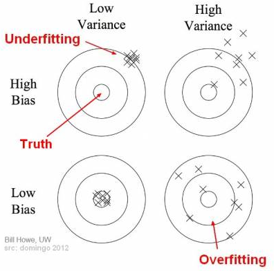

# Come aumentare le performance dei modelli

L'aumento delle performance si esegue con **Model Selection**: si scelgono i migliori parametri del modello di machine learning.

Ci sono due tipi di parametri:

- quelli scelti dall'algoritmo
- quelli scelti da noi (hyper parameters)

La scelta dei parametri dev'essere ottimale e quindi viene effettuata tramite la tecnica **Grid Search**.

Prima dobbiamo ottimizzare il modo di valutare un modello.

## K-fold Cross Validation

1. si splitta il dataset in training set e test set
2. si splitta il training in set in k set
3. ogni k-esimo set viene a sua volta visto come training + test e se ne provano varie combinazioni
4. alla fine si guarda la media della precisione delle valutazioni e si osserva la varianza

A seconda della varianza siamo in uno dei 4 casi:

---

## Come scegliere il giusto modello

Capisci se è un problema di classificazione, regressione o clustering

- **se non hai una variabile dipendente** (y) allora è un problema di **clustering** 
- altrimenti controlla se la y è continua o discreta
  - se **y** è **continua** è un problema di **regressione**
  - se **y** è **discreta** è un problema di **classificazione**

E' un **problema lineare o non lineare**?

- questo si scopre con **grid search**

---

## XGBoost

XGBoost è l'implementazione più fermormante di **gradient boosting**.
